# Ingesting Local Data into Azure Data Lake Store

[Azure Data Lake Store](https://azure.microsoft.com/en-us/services/data-lake-store/) (ADLS) is a repository for big data analytic workloads, enabling you to capture data for operational and exploratory analytics. In this tutorial you'll learn how to use StreamSets Data Collector (SDC) to send data from on-premise disk storage to ADLS, converting it from CSV to JSON format, and masking personally identifiable information (PII) along the way.

The tutorial has two components: adding SDC as an Azure application, which you need only do once, and configuring the ADLS destination, which you must do for each pipeline that sends data to ADLS.

## Prerequisites

* [Download](https://streamsets.com/opensource/) and [install](https://streamsets.com/documentation/datacollector/latest/help/#Installation/InstallationAndConfig.html#concept_gbn_4lv_1r) StreamSets Data Collector (SDC). This tutorial uses SDC 2.3.0.1, but the instructions should apply to subsequent versions. Please [file an issue](https://github.com/streamsets/tutorials/issues/new) if this is not the case!
* I highly recommend you complete the the [taxi data tutorial](https://streamsets.com/documentation/datacollector/latest/help/#Tutorial/Overview.html) included in the SDC documentation. It provides a great introduction to building data pipelines with SDC.
* You will need a Microsoft Azure account. At the time of writing, you can [create a free Azure account](https://azure.microsoft.com/en-us/free/), including $200 free credit and 30 days of Azure services - more than enough to complete this tutorial!

## Azure Data Lake Store

Azure Data Lake Store is an Apache Hadoop file system compatible with Hadoop Distributed File System (HDFS). ADLS works with the Hadoop ecosystem; data stored in Data Lake Store can be analyzed using tools such as Spark, MapReduce and Hive. Microsoft Azure HDInsight clusters can be provisioned and configured to directly access data stored in Data Lake Store.

The [Data Lake Store learning path](https://azure.microsoft.com/en-us/documentation/learning-paths/data-lake-store-self-guided-training/) is a great place to get more information on ADLS.

## Adding StreamSets Data Collector as an Azure Application

Before an application can send data to ADLS, it must be added to your Azure configuration. Doing so generates credentials that the application can use to securely send data to Azure. You need only do this once - all of your pipelines can share the credentials.

1. Log in to the ['classic' Azure portal](https://manage.windowsazure.com/).

2. Select your directory, click the **Applications** tab, and then click the **Add** button at the bottom of the screen.

   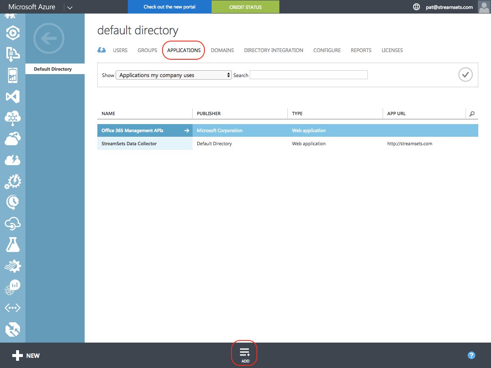

3. On the **What do you want to do?** screen, click **Add an application my organization is developing**. 

   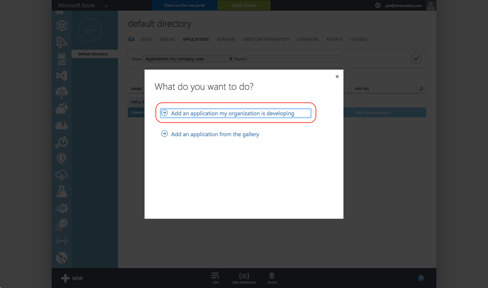

4. On the **Tell us about your application** screen, enter the application name, `StreamSets Data Collector`. Leave the default **Web Application and/or Web API** option selected and click the arrow to proceed.

   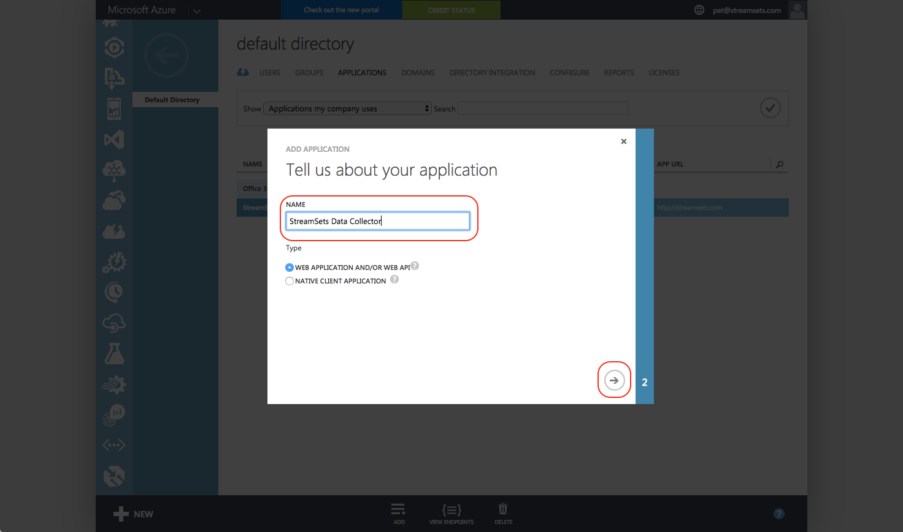

5. On the **App Properties** screen, enter a URL for the **Sign-On URL** and **App ID URI**. These fields are not important to the integration; you can set them to any descriptive URL. Click the checkmark to complete the process of adding the application. Azure adds the application and displays a welcome screen.

   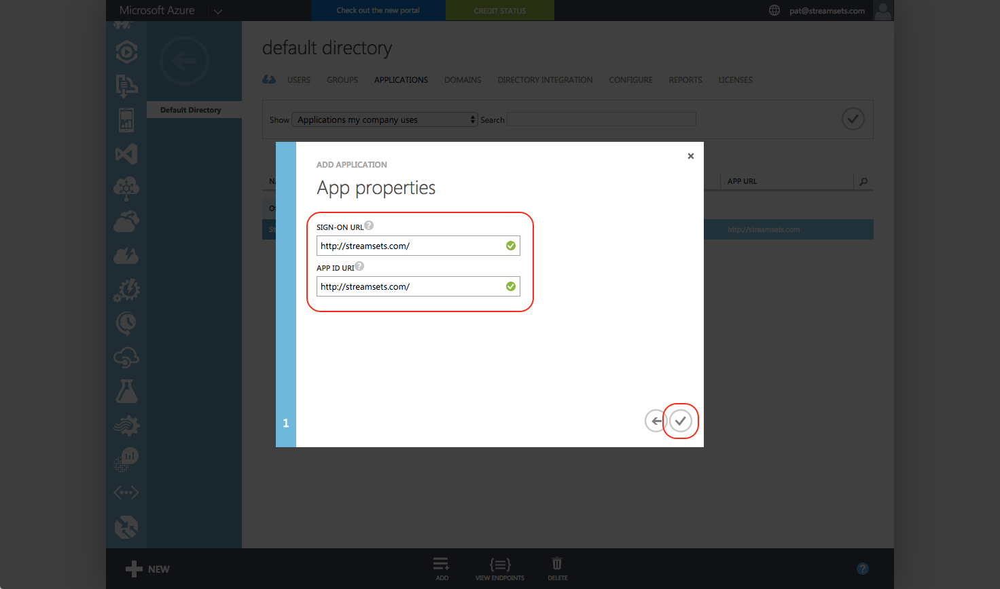

6. Click the **Configure** tab.

   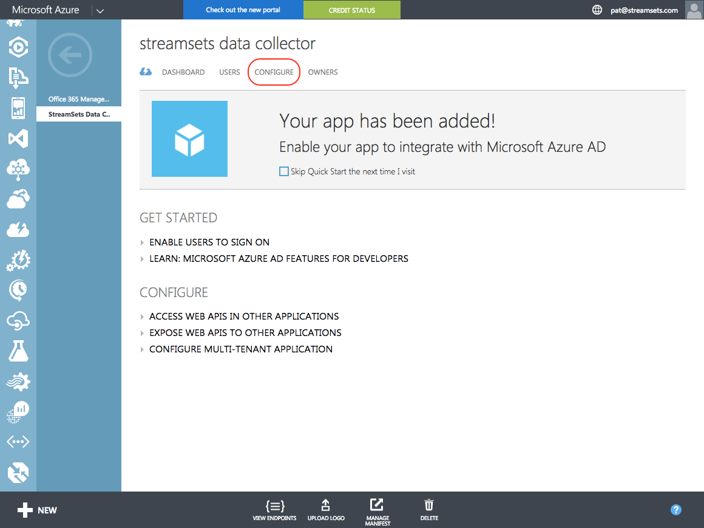

7. Scroll down to the **Keys** section, select a key duration and click **Save** (at the bottom of the page). Copy the resulting key value and keep it in a safe place for future use, as you will **NOT** be able to access it after you leave the page!

	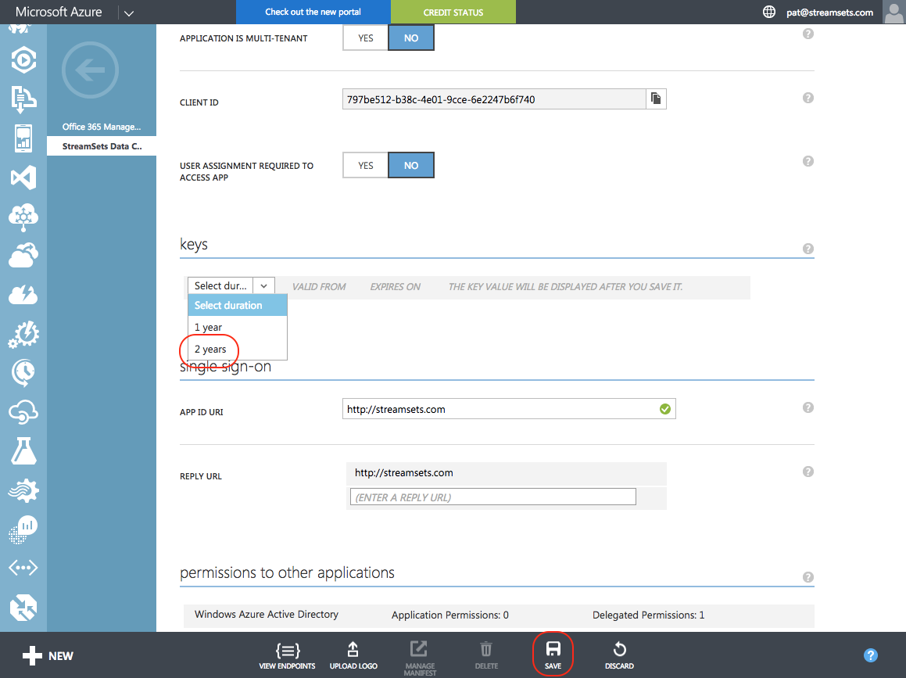

	

Leave the application properties page open, as we will be copying credentials from the application configuration into SDC.

## Create an Azure Data Lake Store

You will need to create an Azure Data Lake Store and a directory to hold output data, and allow SDC to write to it.

1. Open a new browser window and log in to the [new Azure portal](https://portal.azure.com). Click **+ New** (top left), search for `Data Lake Store`, select it, and click **Create**.

  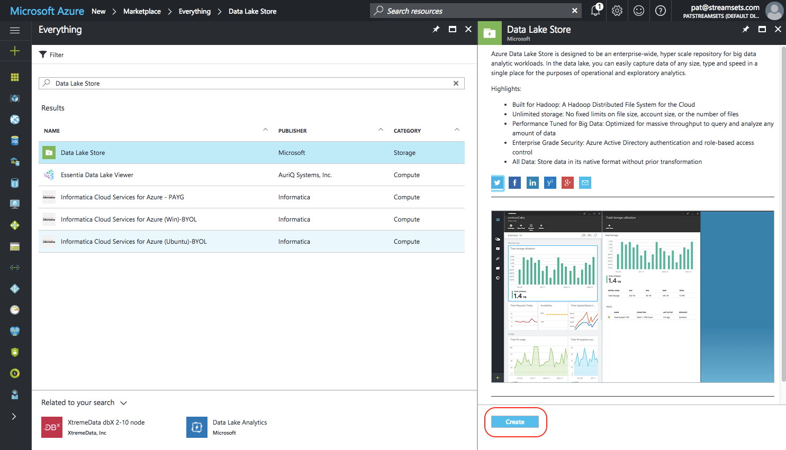

2. Enter a name and either create a new resource group or select an existing resource group if you already have one. Click **Create**.

  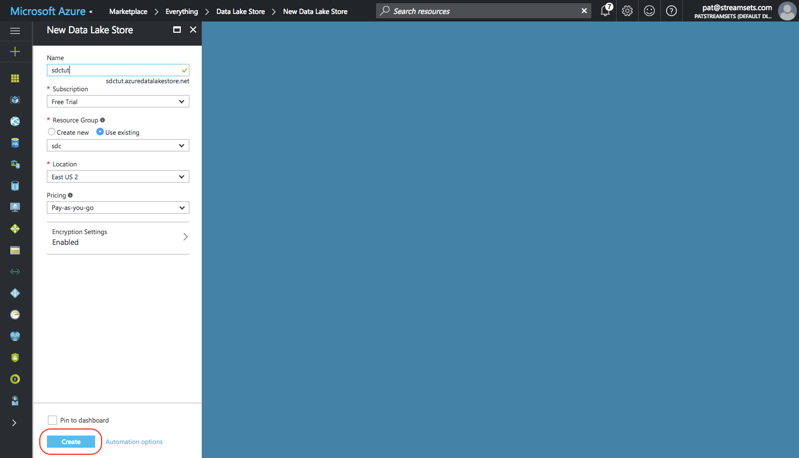

3. After a few moments you should be notified that your Data Lake Store has been deployed. Open the left hand menu, click **All Resources**, select the new Data Lake Store and click **Data Explorer**.

  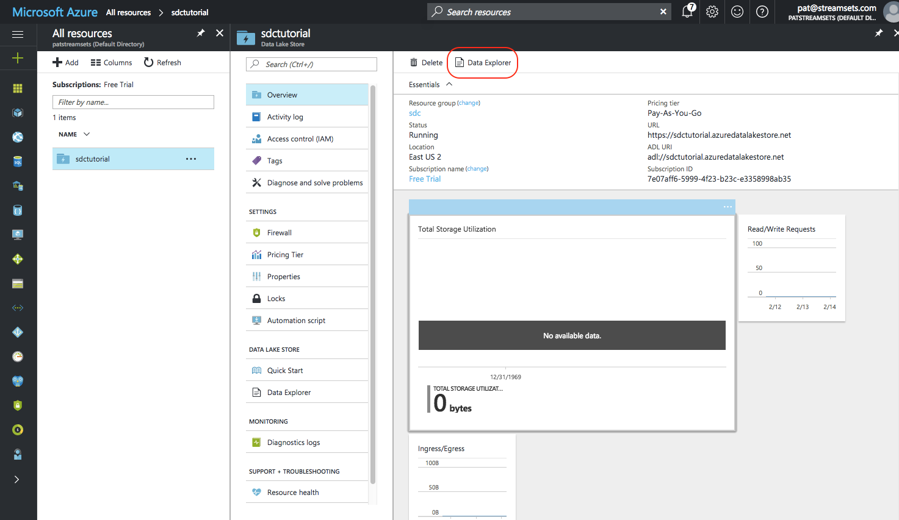

5. Click **Access** and then **Add**.

  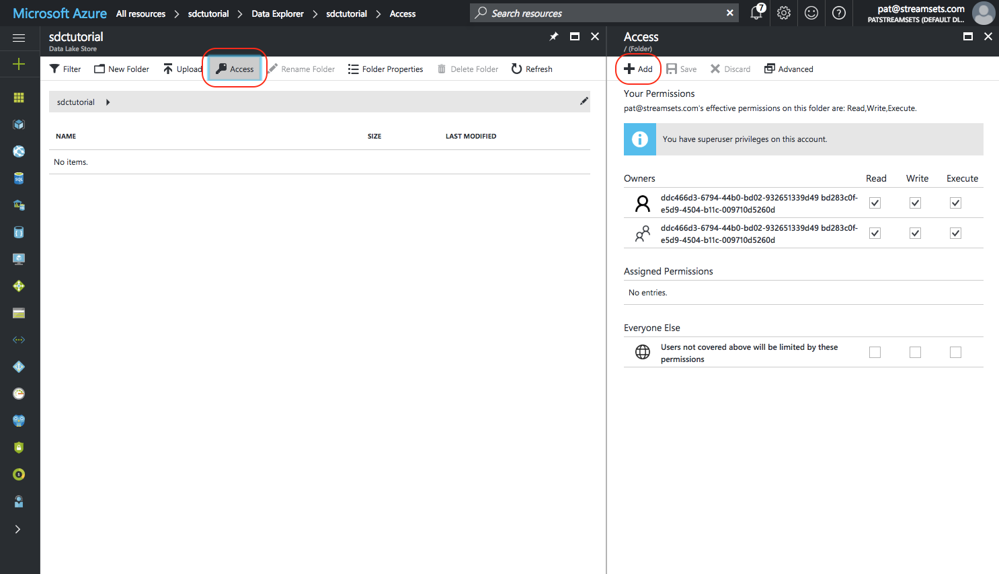

6. Click **Select User or Group**, then click **StreamSets Data Collector** in the list and click **Select**.

  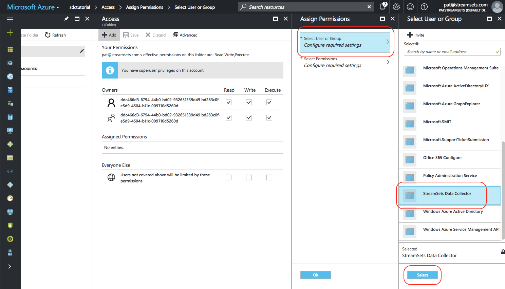

7. Enable **Execute** permission and click **Ok**. ADLS is a hierarchical store similar to a Posix file system. Applications must have execute permissions at every level above a directory to be able to write to that directory.
  
  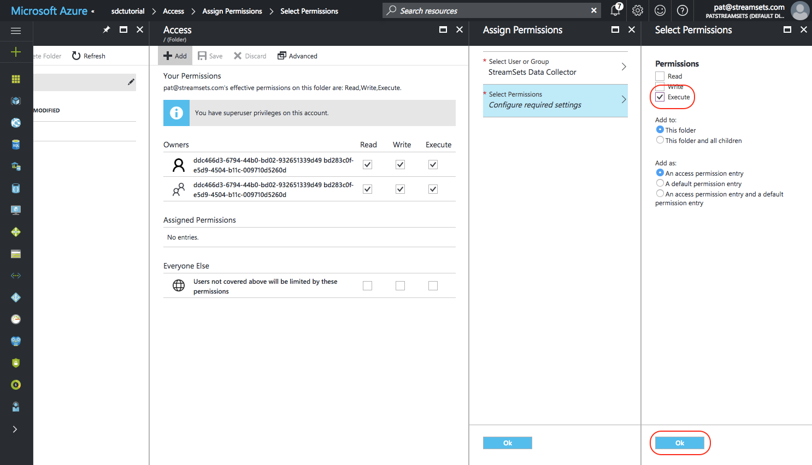

8. Close the Access pane and click **New Folder**. Enter `taxi` as the folder name and click **OK**.

  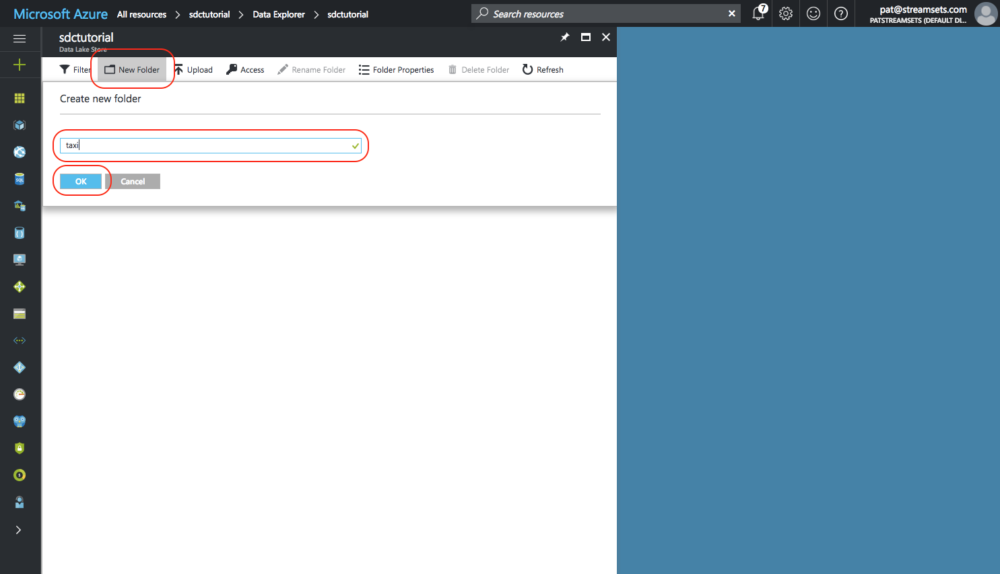

9. Click the new **taxi** directory, click **Access**, **Add**, select **StreamSets Data Collector** 
and give the application **Read**, **Write** and **Execute** permissions, as it will need to write to this directory.

  

Leave the Data Lake Store window open as we will need to copy some of its configuration later.

## Writing Data to Azure Data Lake Store

Now that you've added StreamSets Data Collector as an Azure application, you can create a pipeline to write data to Azure Data Lake Store. We'll create a very simple pipeline here, reading records from a CSV-formatted file of New York City taxi transactions, masking out credit card numbers, and writing records in JSON format to a file in ADLS.

1. Download the [sample CSV data](https://www.streamsets.com/documentation/datacollector/sample_data/tutorial/nyc_taxi_data.csv) and save it in a convenient location accessible to SDC.

2. In your browser, login to SDC and create a new pipeline. Click the **Error Records** tab in the configuration panel and set the pipeline's **Error Records** property according to your preference. Since this is a tutorial, you could discard error records, but in a production system you would write them to a file or queue for later analysis.

3. Add a **Directory** origin and configure it as follows. Leave unmentioned fields with their default values.

   **General** tab

   * **Name**: `Read CSV from Local Directory`
   
   **Files** tab

   * **Files Directory**: the directory containing the sample CSV file
   * **File Name Pattern**: `nyc_taxi_data.csv`

   **Data Format** tab

   * **Data Format**: Delimited
   * **Header Line**: With Header Line

   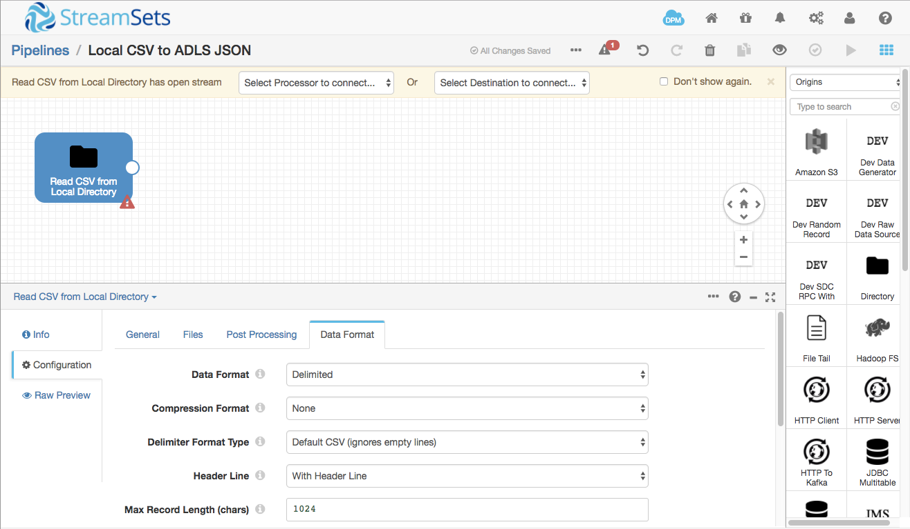

4. Add a **Field Masker** processor, with its input linked to the Directory’s output and configure it thus:

   **General** tab

   * **Name**: `Mask Card Number`

   **Mask** tab

   * **Fields to Mask**: `/credit_card`
   * **Mask Type**: Regular Expression
   * **Regular Expression**: `(.*)([0-9]{4})`
   * **Groups To Show**: `2`

5. Hit the **Preview** icon on the toolbar, and click **Run Preview**. Click the **Mask Card Number** stage, open the first record in the preview panel, and you should see the taxi transaction fields, including the credit card number before and after the masking process:

    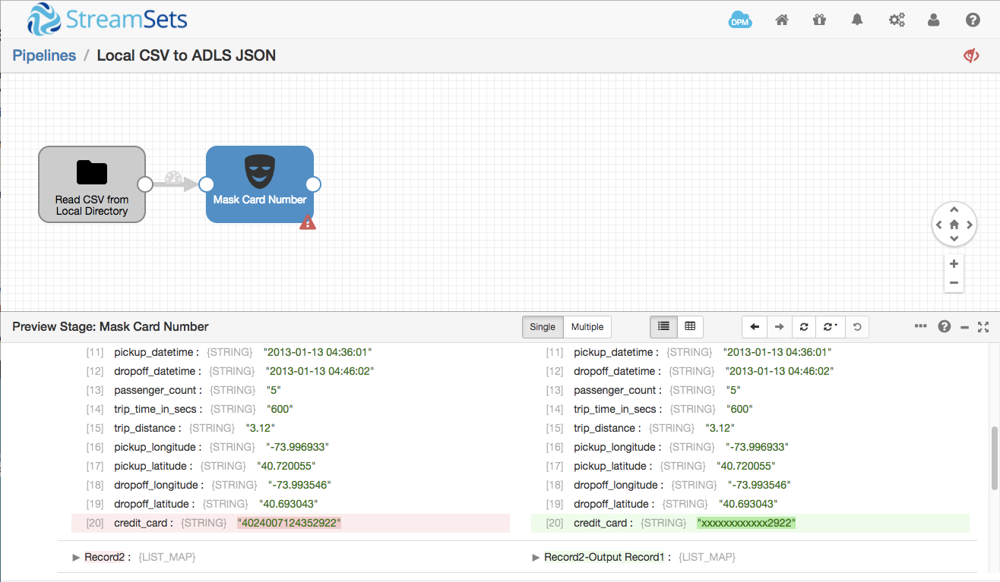

7. Add an **Azure Data Lake Store** destination, with its input linked to the Field Masker's output and configuration:

	**General** tab

   	* **Name**: `Send to Azure Data Lake Store`

   	**Data Lake** tab

   	* **Client ID**: copy the **Client ID** from the Azure application properties page, and paste it into this field

   	  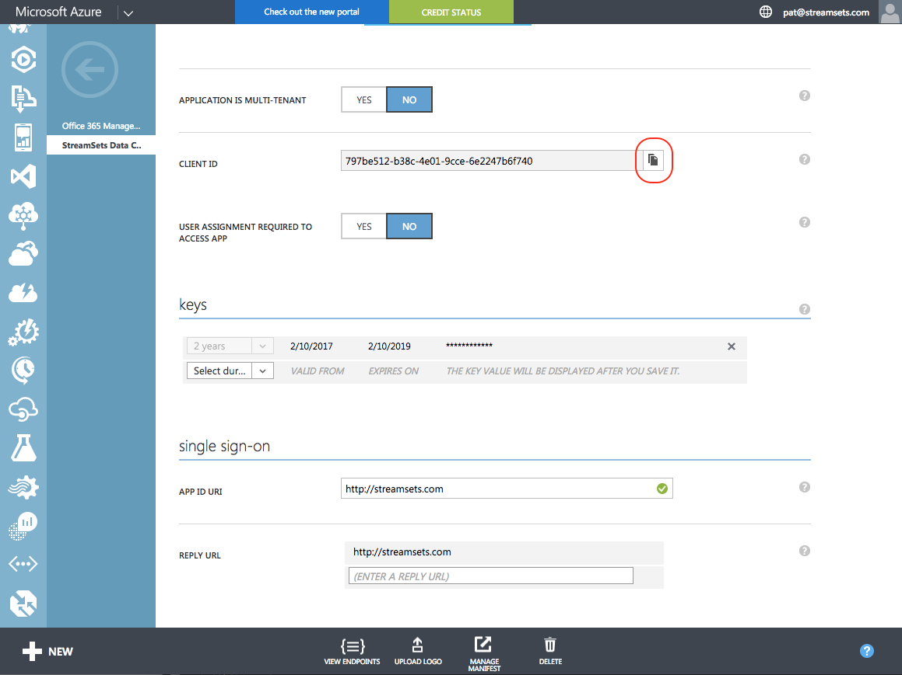

   	* **Auth Token Endpoint**: click **View Endpoints** at the bottom of the Azure application properties page, copy the OAuth 2.0 Token Endpoint, and paste it into this field

   	  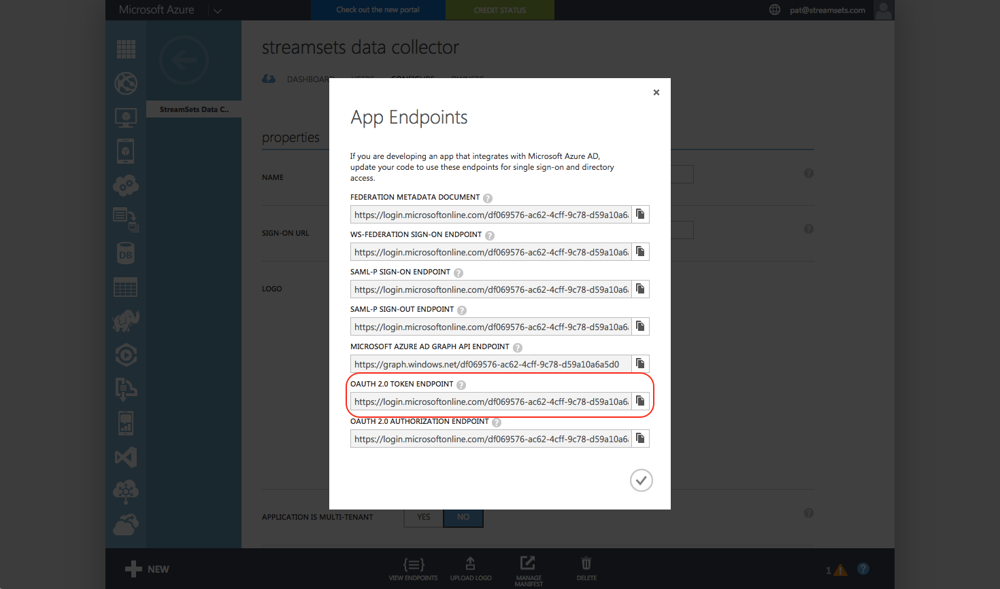

   	* **Account FQDN**: copy the **URL** from the Data Lake Store overview. **IMPORTANT**: paste only the fully-qualified domain name, for example, `sdctutorial.azuredatalakestore.net`, into this field. **DO NOT** paste the `https://` prefix!

      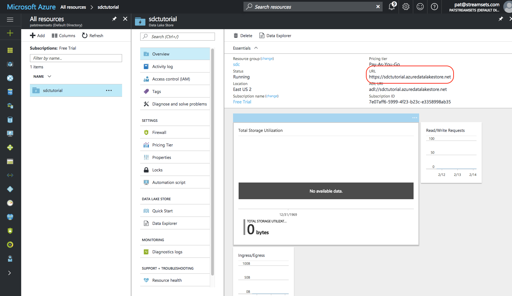

   	* **Client Key**: paste in the key that you copied from the Azure application properties.

   	Your Data Lake tab should look like this:

   	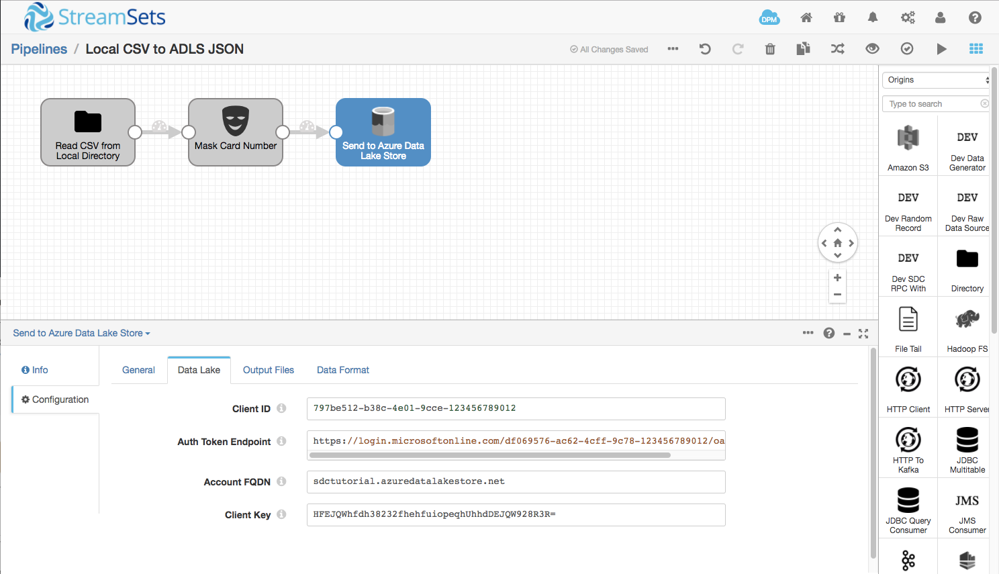

   	**Output Files** tab:

   	* **Directory Template**: `/taxi/${YYYY()}-${MM()}-${DD()}-${hh()}`
   	* **Max Records in File**: 5000

    We set the maximum records per file to 5000 so we can easily see that files are being created in ADLS. In a real deployment we would typically set this to a *much* higher value!

   	**Data Format** tab:

   	* **Data Format**: JSON

8. Hit the **Run** icon. The pipeline should start ingesting data, and write all 5386 records to ADLS in just a few seconds:

	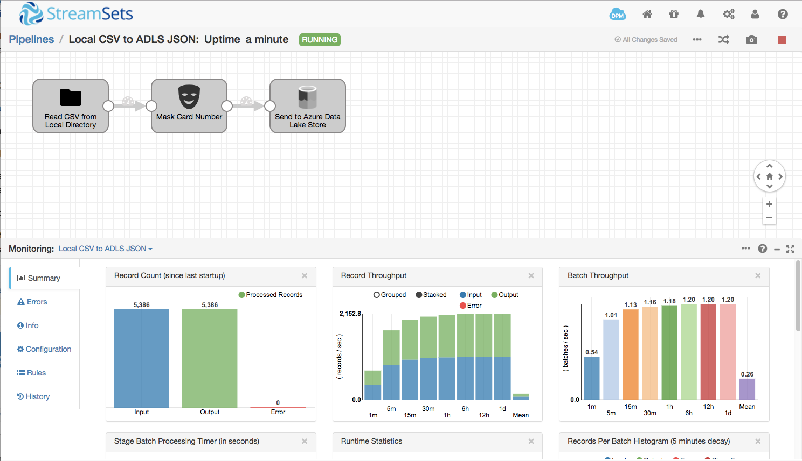

9. In the Data Lake Store window, navigate to the `taxi` folder, and click on the newly created subfolder there. You should see two files. One of the files, prefixed `sdc-`, holds the first 5000 records; the other file, prefixed `_tmp_`, holds the remaining 386 records. Since it is being held open for writing by SDC, its size is shown as 0 bytes:

	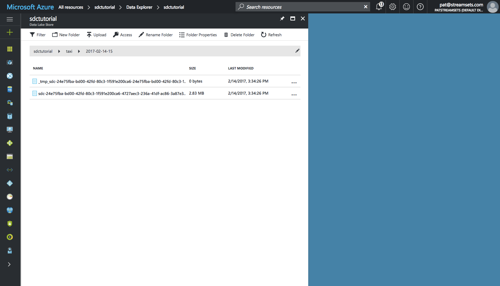

	If the pipeline were to process more data, it would be written to the `_tmp_` file until there were 5000 records there. As it is, you can just stop the pipeline in SDC. Refresh the view of the ADLS folder, and you will see that the second file has been closed and renamed:

	

10. Click one of the files to preview it, click **Format**, select **Text** and click **Ok**. You should see your JSON format data in ADLS, with the credit card numbers masked (note - not all records have credit card numbers):

    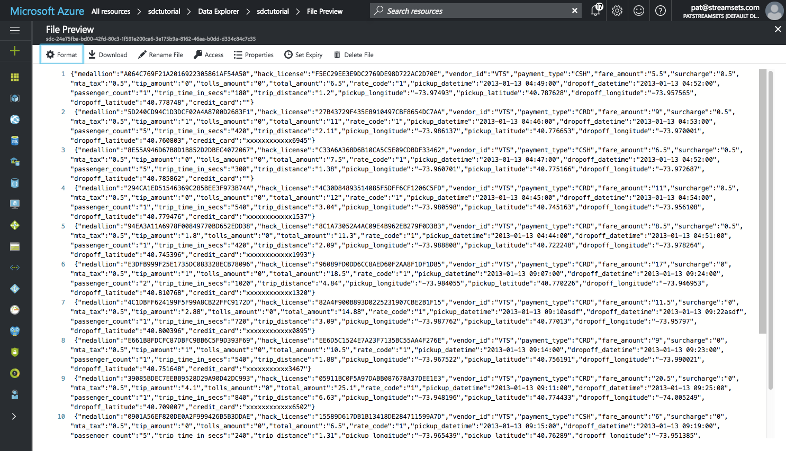

Your data is now in Azure Data Lake Store in JSON format, with PII masked, and ready for analysis.

## Conclusion

This tutorial walked you through the steps of configuring a StreamSets Data Collector pipeline to read a CSV-formatted file, process it to mask credit card numbers, and write JSON-formatted records to a file in Azure Data Lake Store. You can use the same principles to create pipelines to ingest data into ADLS from [any data source supported by SDC](https://streamsets.com/connectors/).