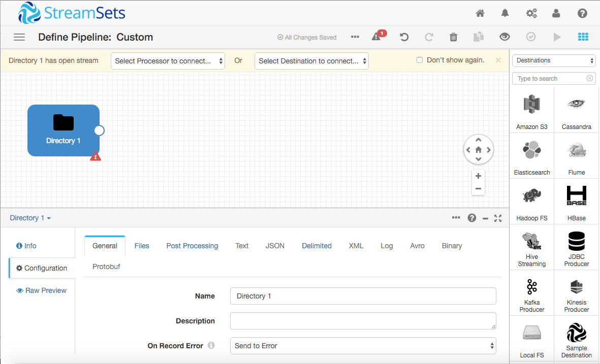
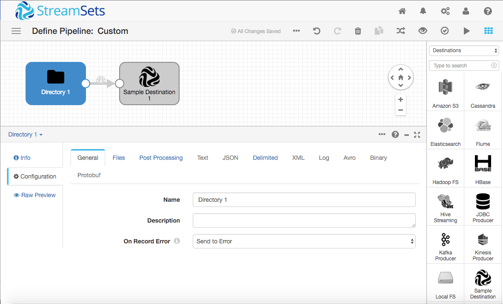
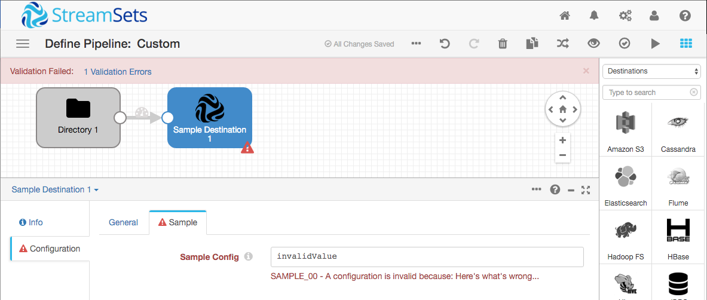
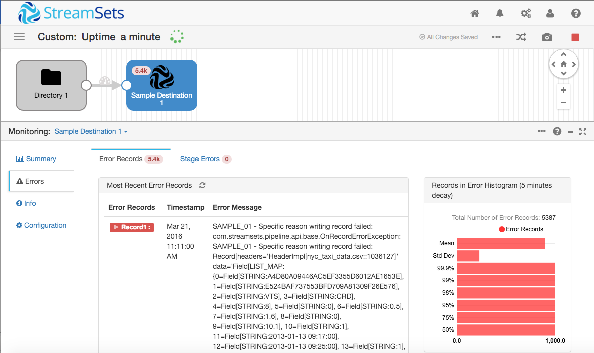
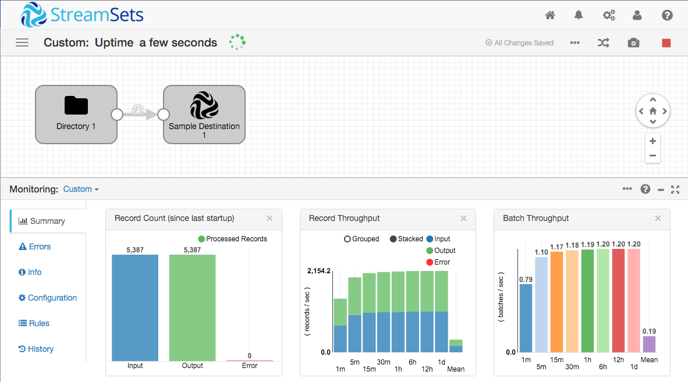
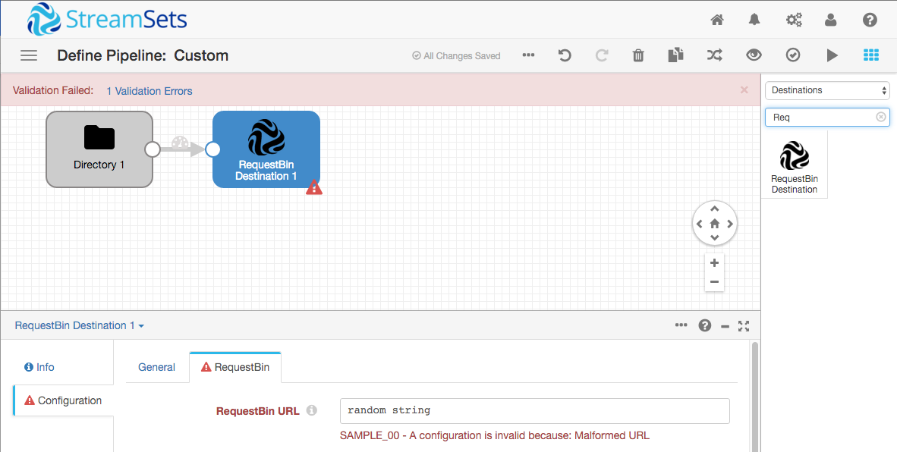
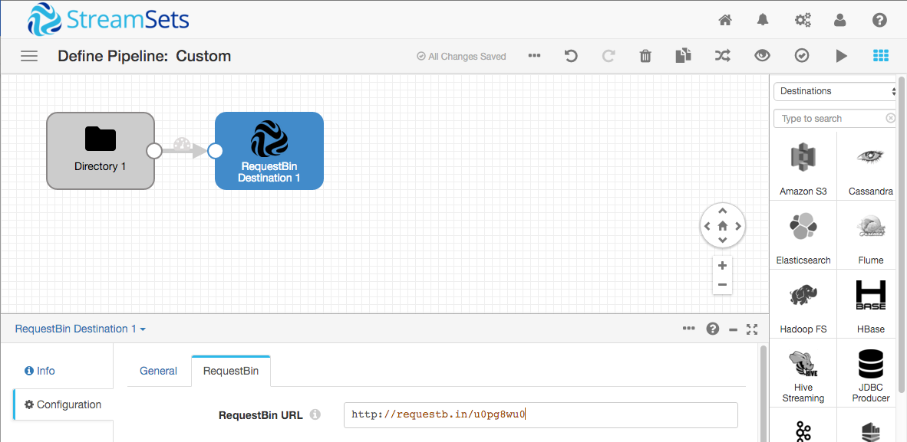
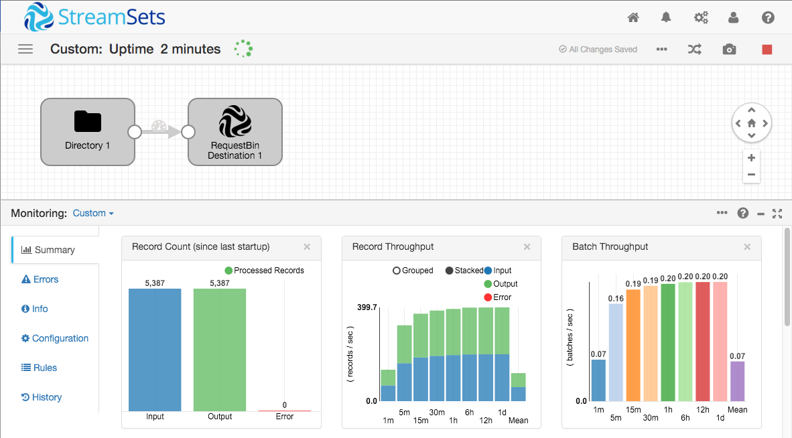
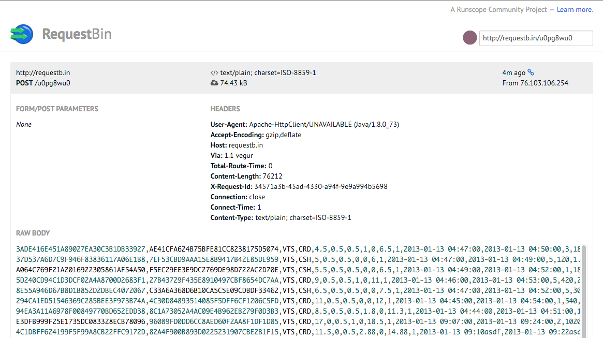

Creating a Custom StreamSets Destination
========================================

This tutorial explains how to get started writing your own custom StreamSets destination.

### What is a StreamSets Destination?

StreamSets Data Collector (SDC) allows you to build continuous data pipelines, each of which consumes record-oriented data from a single *origin*, optionally operates on those records in one or more *processors* and writes data to one or more *destinations*. Origins, processors and destinations are collectively referred to as *stages*.

For example, this pipeline, based on the [SDC taxi data tutorial](https://streamsets.com/documentation/datacollector/latest/help/#Tutorial/Overview.html), uses the Directory origin, four processors, and the Hadoop File System destination:


A destination can write records to persistent storage, send them to an API, or even just quietly discard them - the only restriction is that the destination terminates the pipeline.

A destination is implemented as one or more Java classes. Typically, one class implements `BaseTarget` and handles record processing, with a subclass handling configuration.

### Creating and Building a Destination Template

Follow the documentation to download, install and run StreamSets Data Collector. The [taxi data tutorial](https://streamsets.com/documentation/datacollector/latest/help/#Tutorial/Overview.html) gives an excellent grounding in how SDC works, and also provides a handy supply of test data for your destination. I highly recommend you follow it, if you haven’t already done so.

Next, download the source for the Data Collector and its API. You will want to ensure that you have matching versions for the runtime and source, so you might find it easiest to download tarballs from the relevant GitHub release pages rather than using `git clone`:

* [https://github.com/streamsets/datacollector/releases](https://github.com/streamsets/datacollector/releases)
* [https://github.com/streamsets/datacollector-api/releases](https://github.com/streamsets/datacollector-api/releases)

This tutorial uses version 1.2.2.0, but the instructions should apply to subsequent versions. Please [file an issue](https://github.com/streamsets/tutorials/issues/new) if this is not the case!

You will need to build both the Data Collector and its API. Since we just need the pipeline library JAR files and we already have the SDC runtime, we can skip building the GUI and running tests, saving a bit of time:

```
$ cd datacollector-api
$ mvn clean install -DskipTests
...output omitted...
$ cd ../datacollector
$ mvn clean install -DskipTests
...output omitted...
```

Maven puts the library JARs in its repository, so they’re available when we build our custom destination:

```
$ ls ~/.m2/repository/com/streamsets/streamsets-datacollector-commonlib/1.2.2.0/
_remote.repositories
streamsets-datacollector-commonlib-1.2.2.0-tests.jar
streamsets-datacollector-commonlib-1.2.2.0.jar
Streamsets-datacollector-commonlib-1.2.2.0.pom
```

Finally, create a new custom stage project using the Maven archetype:

```
$ mvn archetype:generate -DarchetypeGroupId=com.streamsets -DarchetypeArtifactId=streamsets-datacollector-stage-lib-tutorial -DarchetypeVersion=1.2.2.0 -DinteractiveMode=true
[INFO] Scanning for projects...
[INFO]                                                                         
[INFO] ------------------------------------------------------------------------
[INFO] Building Maven Stub Project (No POM) 1
[INFO] ------------------------------------------------------------------------
[INFO] 
[INFO] >>> maven-archetype-plugin:2.4:generate (default-cli) > generate-sources @ standalone-pom >>>
[INFO] 
[INFO] <<< maven-archetype-plugin:2.4:generate (default-cli) < generate-sources @ standalone-pom <<<
[INFO] 
[INFO] --- maven-archetype-plugin:2.4:generate (default-cli) @ standalone-pom ---
[INFO] Generating project in Interactive mode
[INFO] Archetype repository not defined. Using the one from [com.streamsets:streamsets-datacollector-stage-lib-tutorial:1.1.4] found in catalog remote
Define value for property 'groupId': : com.example
Define value for property 'artifactId': : samplestage
Define value for property 'version':  1.0-SNAPSHOT: : 
Define value for property 'package':  com.example: : 
Confirm properties configuration:
groupId: com.example
artifactId: samplestage
version: 1.0-SNAPSHOT
package: com.example
 Y: : 
[INFO] ----------------------------------------------------------------------------
[INFO] Using following parameters for creating project from Archetype: streamsets-datacollector-stage-lib-tutorial:1.2.2.0
[INFO] ----------------------------------------------------------------------------
[INFO] Parameter: groupId, Value: com.example
[INFO] Parameter: artifactId, Value: samplestage
[INFO] Parameter: version, Value: 1.0-SNAPSHOT
[INFO] Parameter: package, Value: com.example
[INFO] Parameter: packageInPathFormat, Value: com/example
[INFO] Parameter: package, Value: com.example
[INFO] Parameter: version, Value: 1.0-SNAPSHOT
[INFO] Parameter: groupId, Value: com.example
[INFO] Parameter: artifactId, Value: samplestage
[INFO] project created from Archetype in dir: /Users/pat/src/samplestage
[INFO] ------------------------------------------------------------------------
[INFO] BUILD SUCCESS
[INFO] ------------------------------------------------------------------------
[INFO] Total time: 59.632 s
[INFO] Finished at: 2016-03-20T21:30:58-07:00
[INFO] Final Memory: 12M/116M
[INFO] ------------------------------------------------------------------------
```

Maven generates a template project from the archetype in a directory with the `artifactId` you provided as its name. As you can see, there is template code for an origin, a processor and a destination.


Now you can build the template:

```
$ cd samplestage
$ mvn clean package -DskipTests
[INFO] Scanning for projects...
[INFO]                                                                         
[INFO] ------------------------------------------------------------------------
[INFO] Building samplestage 1.0-SNAPSHOT
[INFO] ------------------------------------------------------------------------
...output omitted…
[INFO] Building tar : /Users/pat/src/samplestage/target/samplestage-1.0-SNAPSHOT.tar.gz
...output omitted...
```

Extract the tarball to SDC’s `user-libs` directory, restart SDC, and you should see the sample stages in the stage library:

```
$ cd ~/streamsets-datacollector-1.2.2.0/user-libs/
$ tar xvfz /Users/pat/src/samplestage/target/samplestage-1.0-SNAPSHOT.tar.gz
x samplestage/lib/samplestage-1.0-SNAPSHOT.jar
```


### Understanding the Destination Template Code

Let’s walk through the template code, starting with `SampleTarget.java`.

As mentioned above, Destinations extend `BaseTarget`:

```
public abstract class SampleTarget extends BaseTarget {
```

An abstract method allows the destination to get configuration data from its subclass:

```
  /**
   * Gives access to the UI configuration of the stage provided by the {@link SampleDTarget} class.
   */
  public abstract String getConfig();
```

SDC calls the `init()` method when validating and running a pipeline. The sample shows how to report configuration errors.

```
  /** {@inheritDoc} */
  @Override
  protected List<ConfigIssue> init() {
    // Validate configuration values and open any required resources.
    List<ConfigIssue> issues = super.init();

    if (getConfig().equals("invalidValue")) {
      issues.add(
          getContext().createConfigIssue(
              Groups.SAMPLE.name(), "config", Errors.SAMPLE_00, "Here's what's wrong..."
          )
      );
    }

    // If issues is not empty, the UI will inform the user of each configuration issue in the list.
    return issues;
  }
```

SDC calls `destroy()` during validation, and when a pipeline is stopped:

```
  /** {@inheritDoc} */
  @Override
  public void destroy() {
    // Clean up any open resources.
    super.destroy();
  }
```

The batch `write()` method is where the action is. SDC will call this for each batch of records. The sample shows how to handle errors when writing records, based on the current context:

```
  /** {@inheritDoc} */
  @Override
  public void write(Batch batch) throws StageException {
    Iterator<Record> batchIterator = batch.getRecords();

    while (batchIterator.hasNext()) {
      Record record = batchIterator.next();
      try {
        write(record);
      } catch (Exception e) {
        switch (getContext().getOnErrorRecord()) {
          case DISCARD:
            break;
          case TO_ERROR:
            getContext().toError(record, Errors.SAMPLE_01, e.toString());
            break;
          case STOP_PIPELINE:
            throw new StageException(Errors.SAMPLE_01, e.toString());
          default:
            throw new IllegalStateException(
                Utils.format("Unknown OnError value '{}'", getContext().getOnErrorRecord(), e)
            );
        }
      }
    }
  }
```

Finally, the record `write()` method can be used to write individual records. However, since it’s not part of the `BaseTarget` signature, you may structure your code differently if you don’t need to write records outside the batch  `write()` method.

```
  /**
   * Writes a single record to the destination.
   *
   * @param record the record to write to the destination.
   * @throws OnRecordErrorException when a record cannot be written.
   */
  private void write(Record record) throws OnRecordErrorException {
    // This is a contrived example, normally you may be performing an operation that could throw
    // an exception or produce an error condition. In that case you can throw an OnRecordErrorException
    // to send this record to the error pipeline with some details.
    if (!record.has("/someField")) {
      throw new OnRecordErrorException(Errors.SAMPLE_01, record, "exception detail message.");
    }

    // TODO: write the records to your final destination
  }
```

### Running the Sample Destination in a Pipeline

Let’s run a pipeline with the sample destination, then extend it to do more. For simplicity, we’ll just use the Directory origin to read records from the NYC Taxi Data file.

Follow [the tutorial](https://streamsets.com/documentation/datacollector/latest/help/#Tutorial/Overview.html) as far as creating the origin - your pipeline should look like this:



Now just drag the Sample Destination onto the canvas and connect the Directory to it:



Validate the pipeline - you should see the ‘Validation Successful’ message. We can experiment with configuration validation. Select the Sample Destination, click the ‘Sample’ tab, and change the **Sample Config** value from `default` to `invalidValue`. Hit the validate icon again, and you’ll see the expected error:



Reset the **Sample Config** value to `default` (or anything except `invalidValue`!), and try running the pipeline. Again, we see an error, as expected from the sample code:



We could add a processor to the pipeline to add the `/someField` field that the destination code wants to see, but let’s blaze a trail here and start modifying the sample to create our own custom destination.

### Creating a RequestBin Destination

[RequestBin](http://requestb.in/) "gives you a URL that will collect requests made to it and lets you inspect them in a human-friendly way." It’s a very handy tool to debug [webhooks](https://en.wikipedia.org/wiki/Webhook), and we can use it here to simulate a REST API endpoint. We’ll build our destination’s functionality in stages, so you can see how the pieces fit together:

1. Write information to the SDC log
2. Create a buffer of records per batch, in CSV format
3. Allow the user to configure the RequestBin URL
4. Send the CSV data to RequestBin
### Writing to the SDC Log

The first step is to remove that annoying error, and instead write some diagnostic data to the SDC log file.

Open the sample project in your IDE of choice (IntelliJ works well with Maven projects), and edit the record write method. Just comment out the three lines of code there for now:

```
  private void write(Record record) throws OnRecordErrorException {
    // This is a contrived example, normally you may be performing an operation that could throw
    // an exception or produce an error condition. In that case you can throw an OnRecordErrorException
    // to send this record to the error pipeline with some details.
//    if (!record.has("/someField")) {
//      throw new OnRecordErrorException(Errors.SAMPLE_01, record, "exception detail message.");
//    }

    // TODO: write the records to your final destination
  }
```

We could write to the log from the record write method, but that would result in thousands of log entries. Instead, we’ll add some logging to the batch write method. This illustrates an important aspect of developing SDC destinations, and stages in general: operate at the batch level if possible - your code will be much more efficient.

Let’s import the log classes and get a log object as a class variable:

```
import org.slf4j.Logger;
import org.slf4j.LoggerFactory;

public abstract class SampleTarget extends BaseTarget {

    private static final Logger LOG = LoggerFactory.getLogger(SampleTarget.class);
```

Add a line to top of the batch write method:

```
  public void write(Batch batch) throws StageException {
    LOG.info("Writing a batch of records: {}", batch);

    Iterator<Record> batchIterator = batch.getRecords();
```

Now build the destination project again, extract the tarball to the user-libs directory as before, and restart SDC. In another terminal window, tail the SDC log file:

```
$ tail -f ~/streamsets-datacollector-1.2.2.0/log/sdc.log
```

Stop the pipeline if it’s still running, reset the origin, and run it again. This time, there should be no error records, and you should see the log output.



```
2016-03-21 11:45:47,064 [user:*admin] [pipeline:Custom] [thread:runner-pool-2-thread-8] INFO  StandaloneRunner - Starting pipeline Custom 0
2016-03-21 11:45:47,265 [user:*admin] [pipeline:Custom] [thread:runner-pool-2-thread-8-ProductionPipelineRunnable] INFO  SampleTarget - Writing a batch of records: com.streamsets.datacollector.runner.FilterRecordBatch@6a8bac83
2016-03-21 11:45:47,372 [user:*admin] [pipeline:Custom] [thread:runner-pool-2-thread-8-ProductionPipelineRunnable] INFO  SampleTarget - Writing a batch of records: com.streamsets.datacollector.runner.FilterRecordBatch@1d68a09d
2016-03-21 11:45:47,420 [user:*admin] [pipeline:Custom] [thread:runner-pool-2-thread-8-ProductionPipelineRunnable] INFO  SampleTarget - Writing a batch of records: com.streamsets.datacollector.runner.FilterRecordBatch@565c8c61
2016-03-21 11:45:47,446 [user:*admin] [pipeline:Custom] [thread:runner-pool-2-thread-8-ProductionPipelineRunnable] INFO  SampleTarget - Writing a batch of records: com.streamsets.datacollector.runner.FilterRecordBatch@31bda9dd
2016-03-21 11:45:47,466 [user:*admin] [pipeline:Custom] [thread:runner-pool-2-thread-8-ProductionPipelineRunnable] INFO  SampleTarget - Writing a batch of records: com.streamsets.datacollector.runner.FilterRecordBatch@6e5e4dd
2016-03-21 11:45:47,474 [user:*admin] [pipeline:Custom] [thread:runner-pool-2-thread-8-ProductionPipelineRunnable] INFO  SampleTarget - Writing a batch of records: com.streamsets.datacollector.runner.FilterRecordBatch@5ed1c0d4
```

Now we have a ‘clean’ pipeline, let’s format the records as CSV.

### Generating CSV-Formatted Record Data

SDC holds each record in memory as lists or maps of fields; we want to send them to RequestBin in a more portable format. We can create a StringWriter to buffer CSV data, and a DataGenerator to generate it. Note how we pass any exceptions thrown when creating the DataGenerator back to SDC.

```
  public void write(Batch batch) throws StageException {
    LOG.info("Writing a batch of records: " + batch.toString());

    StringWriter writer = new StringWriter();
    DataGenerator gen;
    try {
      gen = new DelimitedCharDataGenerator(writer, CsvMode.CSV.getFormat(), CsvHeader.NO_HEADER, "header", "value", false);
    } catch (IOException ioe) {
      throw new StageException(Errors.WAVE_01, ioe);
    }

    Iterator<Record> batchIterator = batch.getRecords();
```

We will need to call `gen.write(record);` to generate the CSV for each record; we could add an argument to the record write method for the generator and call gen.write from there, but it seems inefficient to call a method for the sole purpose of calling another method, so let’s just replace the call to the record write method:

```
    while (batchIterator.hasNext()) {
      Record record = batchIterator.next();
      try {
        gen.write(record);
      } catch (Exception e) {
```

After the while loop, at the bottom of the batch write method, we’ll close the StringWriter, get its String, and log the amount of buffered data:

```
    }

    try {
      gen.close();
    } catch (IOException ioe) {
      throw new StageException(Errors.SAMPLE_01, ioe);
    }
    String csvBuffer = writer.toString();

    LOG.info("Buffered " + csvBuffer + " bytes of CSV data");
  }
```

We’ll need to add the relevant imports at the top of SampleTarget:

```
import com.streamsets.pipeline.api.Batch;
import com.streamsets.pipeline.api.Record;
import com.streamsets.pipeline.api.StageException;
import com.streamsets.pipeline.api.base.BaseTarget;
import com.streamsets.pipeline.api.base.OnRecordErrorException;
import com.streamsets.pipeline.api.impl.Utils;
import com.streamsets.pipeline.config.CsvHeader;
import com.streamsets.pipeline.config.CsvMode;
import com.streamsets.pipeline.lib.generator.DataGenerator;
import com.streamsets.pipeline.lib.generator.delimited.DelimitedCharDataGenerator;
```

You’ll likely notice that the IDE doesn’t know anything about the classes we just imported - we need to add a dependency to the project’s pom.xml file to make them available:

```
    <dependency>
      <groupId>com.streamsets</groupId>
      <artifactId>streamsets-datacollector-api</artifactId>
      <version>1.2.2.0</version>
      <scope>provided</scope>
    </dependency>
    <!-- 
      Insert the following dependency after streamsets-datacollector-api
      but before slf4j-api
    -->
    <dependency>
      <groupId>com.streamsets</groupId>
      <artifactId>streamsets-datacollector-commonlib</artifactId>
      <version>1.2.2.0</version>
      <scope>provided</scope>
    </dependency>
    <dependency>
      <groupId>org.slf4j</groupId>
      <artifactId>slf4j-api</artifactId>
      <version>${slf4j.version}</version>
      <scope>provided</scope>
    </dependency>
```

Now we can repeat the build/extract steps, but, before we restart SDC, we need to copy commonlib and its dependencies from user-libs/streamsets-datacollector-dev-lib/lib to user-libs/samplestage/lib to make it accessible to our destination at runtime. From the `~/streamsets-datacollector-1.2.2.0/user-libs` directory, do

```
$ cp streamsets-datacollector-dev-lib/lib/streamsets-datacollector-commonlib-1.2.2.0.jar samplestage/lib/
$ cp streamsets-datacollector-dev-lib/lib/commons-io-2.4.jar samplestage/lib/
$ cp streamsets-datacollector-dev-lib/lib/commons-csv-1.1.jar samplestage/lib/
```

*NOTE - at present, you need to copy these libraries into the destination lib directory, either manually or via a script. We are working on how to make this a more automated process.*

Now we can restart SDC, reset the origin, and run the pipeline again. This time, we see more log output:

```
2016-03-21 14:03:15,013 [user:*admin] [pipeline:Custom] [thread:runner-pool-2-thread-1] INFO  StandaloneRunner - Starting pipeline Custom 0
2016-03-21 14:03:15,379 [user:*admin] [pipeline:Custom] [thread:runner-pool-2-thread-1-ProductionPipelineRunnable] INFO  SampleTarget - Writing a batch of records: com.streamsets.datacollector.runner.FilterRecordBatch@7400bb18
2016-03-21 14:03:15,446 [user:*admin] [pipeline:Custom] [thread:runner-pool-2-thread-1-ProductionPipelineRunnable] INFO  SampleTarget - Buffered 194135 bytes of CSV data
2016-03-21 14:03:15,486 [user:*admin] [pipeline:Custom] [thread:runner-pool-2-thread-1-ProductionPipelineRunnable] INFO  SampleTarget - Writing a batch of records: com.streamsets.datacollector.runner.FilterRecordBatch@695ee491
2016-03-21 14:03:15,528 [user:*admin] [pipeline:Custom] [thread:runner-pool-2-thread-1-ProductionPipelineRunnable] INFO  SampleTarget - Buffered 195702 bytes of CSV data
...etc…
```

### Configuring the Destination

Now we are buffering CSV data we need to send it… somewhere! Let’s modify the sample configuration class, `SampleDTarget`, accordingly. While we’re doing that, we can rename the Destination to better reflect its purpose.

```
@StageDef(
    version = 1,
    label = "RequestBin Destination",
    description = "",
    icon = "default.png",
    recordsByRef = true,
    onlineHelpRefUrl = ""
)
@ConfigGroups(value = Groups.class)
@GenerateResourceBundle
public class SampleDTarget extends SampleTarget {

  @ConfigDef(
      required = true,
      type = ConfigDef.Type.STRING,
      defaultValue = "",
      label = "RequestBin URL",
      displayPosition = 10,
      group = "REQUESTBIN"
  )
  public String url;

  /** {@inheritDoc} */
  @Override
  public String getURL() {
    return url;
  }

}
```

The Groups class holds the label for the config tab:

```
@GenerateResourceBundle
public enum Groups implements Label {
  REQUESTBIN("RequestBin"),
  ;

  private final String label;

  private Groups(String label) {
    this.label = label;
  }

  /** {@inheritDoc} */
  @Override
  public String getLabel() {
    return this.label;
  }
}
```

We’ll also need to update `SampleTarget` to match:

```
  /**
   * Gives access to the UI configuration of the stage provided by the {@link SampleDTarget} class.
   */
  public abstract String getURL();
```

We can validate that the user has supplied a valid URL in the `init()` method:

```
  @Override
  protected List<ConfigIssue> init() {
    // Validate configuration values and open any required resources.
    List<ConfigIssue> issues = super.init();

    try {
      URL u = new URL(getURL());
      u.toURI();
    } catch (Exception e) {
      issues.add(
              getContext().createConfigIssue(
                      Groups.REQUESTBIN.name(), "url", Errors.SAMPLE_00, "Malformed URL"
              )
      );
    }

    // If issues is not empty, the UI will inform the user of each configuration issue in the list.
    return issues;
  }
```

Follow the build/extract/restart cycle, and the Destination should have a new name, and it should only accept valid URLs in its configuration. Delete the Sample Destination from your pipeline, drag in a RequestBin Destination, set the RequestBin URL field to some non-URL value, and try validating:



### Write CSV data to RequestBin

The final piece of the puzzle is to write the CSV data to the RequestBin URL. RequestBin simply stores the last 20 requests sent to your bin for up to 48 hours, and lets you inspect the contents of your bin by appending `?inspect` to your bin’s URL.

Since we only need to post some text, we’ll use the [Apache Fluent API](https://hc.apache.org/httpcomponents-client-ga/tutorial/html/fluent.html) rather than the full blown HttpClient. Add the dependency to `pom.xml` after the dependencies for slf4j:

```
    <dependency>
      <groupId>org.apache.httpcomponents</groupId>
      <artifactId>fluent-hc</artifactId>
      <version>4.5.2</version>
    </dependency>
```

Import Request and ContentType in `SampleTarget`:

```
import org.apache.http.client.fluent.Request;
import org.apache.http.entity.ContentType;
```

And change the end of the batch write method:

```
    try {
      gen.close();

      int statusCode = Request.Post(getURL())
              .bodyString(writer.toString(), ContentType.TEXT_PLAIN)
              .execute()
              .returnResponse()
              .getStatusLine()
              .getStatusCode();

      LOG.info("RequestBin returned " + statusCode);
    } catch (IOException ioe) {
      throw new StageException(Errors.SAMPLE_01, ioe);
    }
```

There is one final task to perform before we can send records to RequestBin. The default security policy for custom stages is quite restrictive. In particular, if you try to run this code, you will see the error:

```
java.security.AccessControlException: access denied ("java.net.SocketPermission" "requestb.in" "resolve")
```

We need to edit SDC’s security policy to allow the destination to resolve and connect to requestb.in. Open `~/streamsets-datacollector-1.2.2.0/etc/sdc-security.policy` in your favorite editor and add a new section:

```
grant codebase "file://${sdc.dist.dir}/user-libs/samplestage/-" {
  permission java.net.SocketPermission "requestb.in", "connect, resolve";
};
```

Now go to [RequestBin](http://requestb.in/) and create a new bin, if you have not already done so. After a build/extract/restart, paste your bin URL into the destination config:



If all is well, after a few seconds you should see that all of the taxi data records have been successfully processed:



The log should show RequestBin returning 200 for each batch of records:

```
2016-03-21 17:38:32,401 [user:*admin] [pipeline:Custom] [thread:runner-pool-2-thread-1] INFO  StandaloneRunner - Starting pipeline Custom 0
2016-03-21 17:38:32,819 [user:*admin] [pipeline:Custom] [thread:runner-pool-2-thread-1-ProductionPipelineRunnable] INFO  SampleTarget - Writing a batch of records: com.streamsets.datacollector.runner.FilterRecordBatch@17c2f2f7
2016-03-21 17:38:36,555 [user:*admin] [pipeline:Custom] [thread:runner-pool-2-thread-1-ProductionPipelineRunnable] INFO  SampleTarget - RequestBin returned 200
2016-03-21 17:38:36,591 [user:*admin] [pipeline:Custom] [thread:runner-pool-2-thread-1-ProductionPipelineRunnable] INFO  SampleTarget - Writing a batch of records: com.streamsets.datacollector.runner.FilterRecordBatch@79129b57
2016-03-21 17:38:39,086 [user:*admin] [pipeline:Custom] [thread:runner-pool-2-thread-1-ProductionPipelineRunnable] INFO  SampleTarget - RequestBin returned 200
...etc…
```

And inspecting your RequestBin will show the CSV data that was sent:



### Conclusion

You’ve covered a lot of ground in this tutorial:

* You created a template SDC stage project from the Maven archetype
* You installed the stages into SDC
* You progressively modified the destination to send CSV data to RequestBin

You should be able to apply the principles you’ve learned to making your own destination stages now. Going further, you should change the icon for the destination, as well as the Java class names. These are left as an exercise for the reader.

If you encounter any problems, please, [file an issue in the tutorials project](https://github.com/streamsets/tutorials/issues/new).

