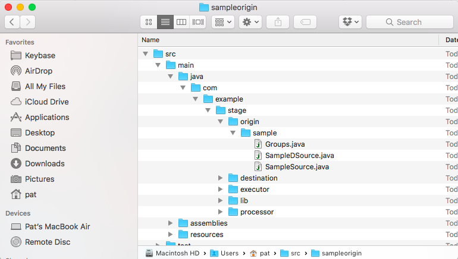
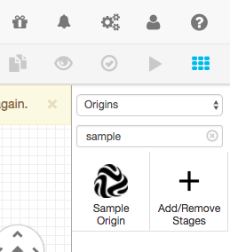
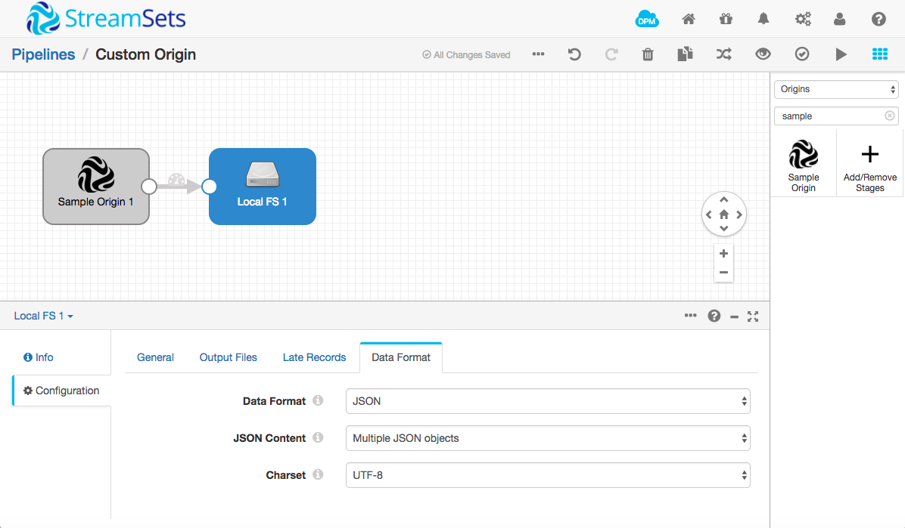
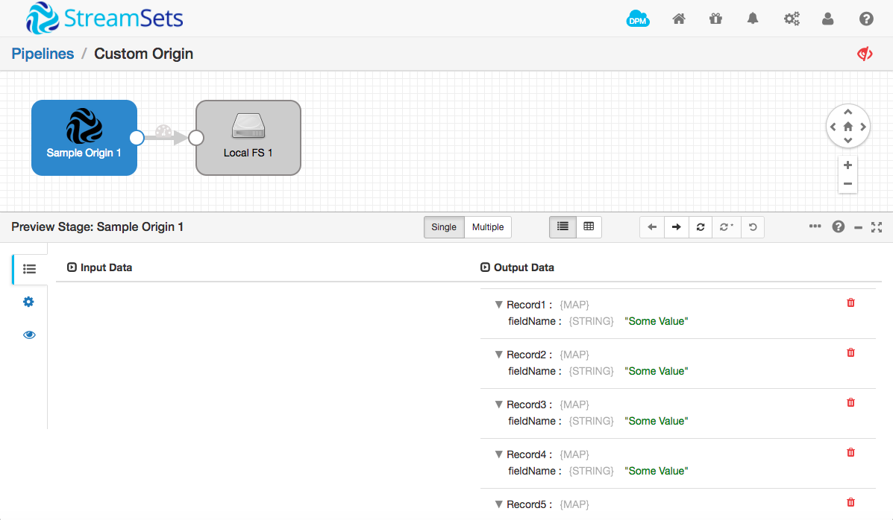
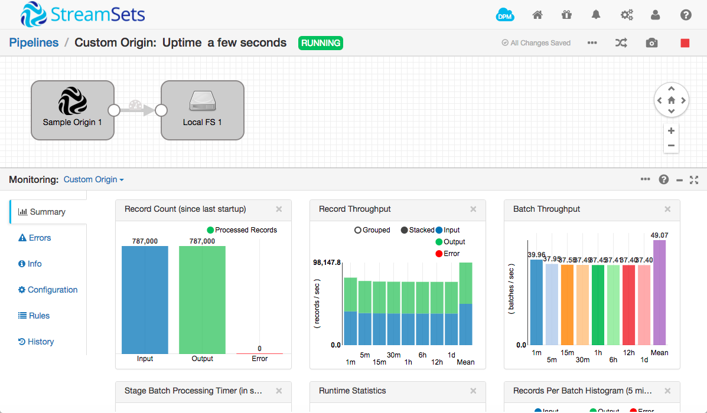
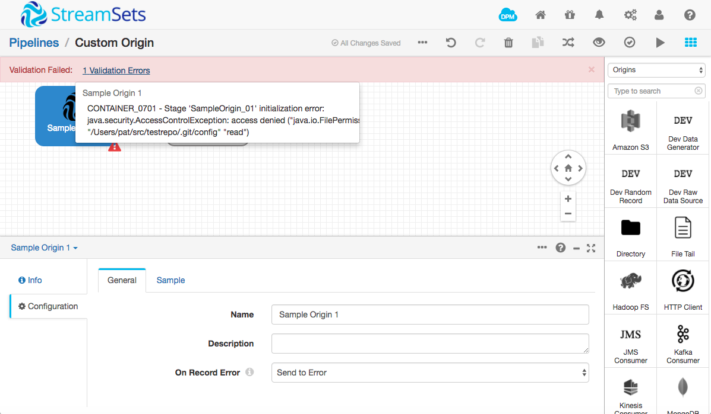
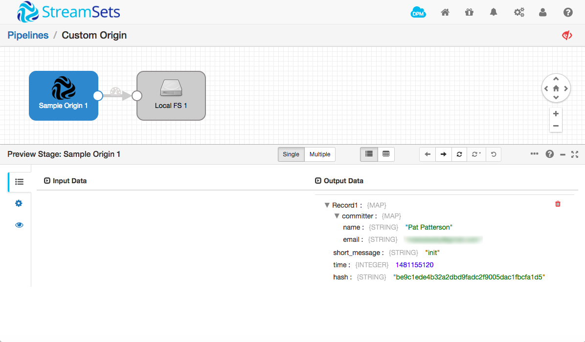
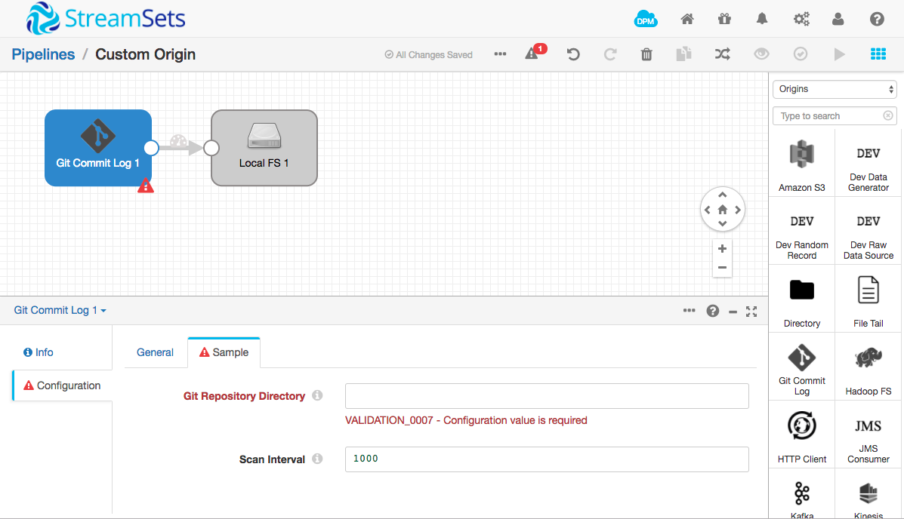
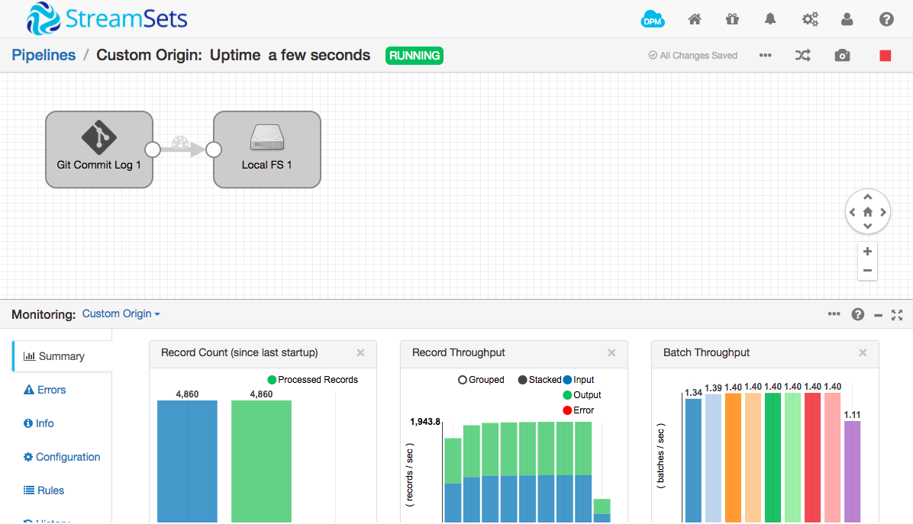
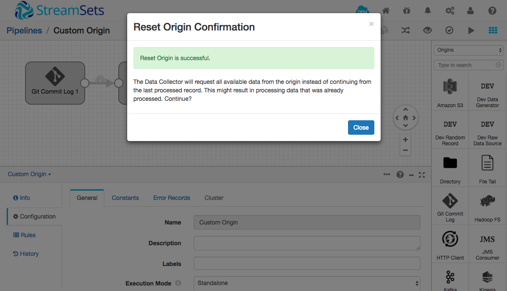

Creating a Custom StreamSets Origin
===================================

This tutorial explains how to get started writing your own custom StreamSets Origin.

### What is a StreamSets Origin?

[StreamSets Data Collector](https://streamsets.com/products/sdc/) (SDC) allows you to build continuous data pipelines, each of which consumes record-oriented data from a single *origin*, optionally operates on those records in one or more *processors* and writes data to one or more *destinations*. Origins, processors and destinations are collectively referred to as *stages*.

For example, this pipeline, based on the [SDC taxi data tutorial](https://streamsets.com/documentation/datacollector/latest/help/#Tutorial/Overview.html), uses the Directory origin, four processors, and the Hadoop File System destination:


An origin reads data from some source, producing records for consumption by the remainder of the pipeline.

An origin is implemented as one or more Java classes. Typically, one class implements `BaseSource` and handles record production, with a subclass handling configuration.

### Creating and Building an Origin Template

Follow [the documentation](http://streamsets.com/docs) to download, install and run StreamSets Data Collector. The [taxi data tutorial](https://streamsets.com/documentation/datacollector/latest/help/#Tutorial/Overview.html) gives an excellent grounding in how SDC works; I highly recommend you follow it, if you haven’t already done so.

This tutorial uses version 2.2.0.0, but the instructions should apply to subsequent versions. Please [file an issue](https://github.com/streamsets/tutorials/issues/new) if this is not the case!

Create a new custom stage project using the Maven archetype:

```console
$ mvn archetype:generate -DarchetypeGroupId=com.streamsets \
-DarchetypeArtifactId=streamsets-datacollector-stage-lib-tutorial \
-DarchetypeVersion=2.2.0.0 -DinteractiveMode=true
[INFO] Scanning for projects...
[INFO]                                                                         
[INFO] ------------------------------------------------------------------------
[INFO] Building Maven Stub Project (No POM) 1
[INFO] ------------------------------------------------------------------------
[INFO] 
[INFO] >>> maven-archetype-plugin:2.4:generate (default-cli) > generate-sources @ standalone-pom >>>
[INFO] 
[INFO] <<< maven-archetype-plugin:2.4:generate (default-cli) < generate-sources @ standalone-pom <<<
[INFO] 
[INFO] --- maven-archetype-plugin:2.4:generate (default-cli) @ standalone-pom ---
[INFO] Generating project in Interactive mode
[INFO] Archetype repository not defined. Using the one from [com.streamsets:streamsets-datacollector-stage-lib-tutorial:1.1.4] found in catalog remote
Define value for property 'groupId': : com.example
Define value for property 'artifactId': : samplestage
Define value for property 'version':  1.0-SNAPSHOT: : 
Define value for property 'package':  com.example: : 
Confirm properties configuration:
groupId: com.example
artifactId: samplestage
version: 1.0-SNAPSHOT
package: com.example
 Y: : 
[INFO] ----------------------------------------------------------------------------
[INFO] Using following parameters for creating project from Archetype: streamsets-datacollector-stage-lib-tutorial:2.2.0.0
[INFO] ----------------------------------------------------------------------------
[INFO] Parameter: groupId, Value: com.example
[INFO] Parameter: artifactId, Value: samplestage
[INFO] Parameter: version, Value: 1.0-SNAPSHOT
[INFO] Parameter: package, Value: com.example
[INFO] Parameter: packageInPathFormat, Value: com/example
[INFO] Parameter: package, Value: com.example
[INFO] Parameter: version, Value: 1.0-SNAPSHOT
[INFO] Parameter: groupId, Value: com.example
[INFO] Parameter: artifactId, Value: samplestage
[INFO] project created from Archetype in dir: /Users/pat/src/samplestage
[INFO] ------------------------------------------------------------------------
[INFO] BUILD SUCCESS
[INFO] ------------------------------------------------------------------------
[INFO] Total time: 59.632 s
[INFO] Finished at: 2016-03-20T21:30:58-07:00
[INFO] Final Memory: 12M/116M
[INFO] ------------------------------------------------------------------------
```

Maven generates a template project from the archetype in a directory with the `artifactId` you provided as its name. As you can see, there is template code for an origin, a processor and a destination.



Now you can build the template:

```console
$ cd samplestage
$ mvn clean package -DskipTests
[INFO] Scanning for projects...
[INFO]                                                                         
[INFO] ------------------------------------------------------------------------
[INFO] Building samplestage 1.0-SNAPSHOT
[INFO] ------------------------------------------------------------------------
...output omitted…
[INFO] Building tar : /Users/pat/src/samplestage/target/samplestage-1.0-SNAPSHOT.tar.gz
...output omitted...
```

Extract the tarball to SDC’s `user-libs` directory, restart SDC, and you should see the sample stages in the stage library:

```console
$ cd ~/streamsets-datacollector-2.2.0.0/user-libs/
$ tar xvfz /Users/pat/src/samplestage/target/samplestage-1.0-SNAPSHOT.tar.gz
x samplestage/lib/samplestage-1.0-SNAPSHOT.jar
```



### Understanding the Origin Template Code

Let’s walk through the template code, starting with `SampleSource.java`.

As mentioned above, Origins extend `BaseSource`:

```java
public abstract class SampleSource extends BaseSource {
```

An abstract method allows the destination to get configuration data from its subclass:

```java
/**
 * Gives access to the UI configuration of the stage provided by the {@link SampleDSource} class.
 */
public abstract String getConfig();
```

SDC calls the `init()` method when validating and running a pipeline. The sample shows how to report configuration errors.

```java
@Override
protected List<ConfigIssue> init() {
  // Validate configuration values and open any required resources.
  List<ConfigIssue> issues = super.init();

  if (getConfig().equals("invalidValue")) {
    issues.add(
        getContext().createConfigIssue(
            Groups.SAMPLE.name(), "config", Errors.SAMPLE_00, "Here's what's wrong..."
        )
    );
  }

  // If issues is not empty, the UI will inform the user of each configuration issue in the list.
  return issues;
}
```

SDC calls `destroy()` during validation, and when a pipeline is stopped:

```java
@Override
public void destroy() {
  // Clean up any open resources.
  super.destroy();
}
```

The `produce()` method is where the action is. SDC will call this repeatedly to create batches of records. The sample shows how to create records with a single field named `fieldName`, containing a string value, `Some Value`.

```java
@Override
public String produce(String lastSourceOffset, int maxBatchSize, BatchMaker batchMaker) throws StageException {
  // Offsets can vary depending on the data source. Here we use an integer as an example only.
  long nextSourceOffset = 0;
  if (lastSourceOffset != null) {
    nextSourceOffset = Long.parseLong(lastSourceOffset);
  }

  int numRecords = 0;

  // TODO: As the developer, implement your logic that reads from a data source in this method.

  // Create records and add to batch. Records must have a string id. This can include the source offset
  // or other metadata to help uniquely identify the record itself.
  while (numRecords < maxBatchSize) {
    Record record = getContext().createRecord("some-id::" + nextSourceOffset);
    Map<String, Field> map = new HashMap<>();
    map.put("fieldName", Field.create("Some Value"));
    record.set(Field.create(map));
    batchMaker.addRecord(record);
    ++nextSourceOffset;
    ++numRecords;
  }

  return String.valueOf(nextSourceOffset);
}
```

Note how a source offset is passed to and returned from the `produce()` method. The offset is key to the operation of continuous pipelines. Origins use the offset to keep track of progress in ingesting data from a source. Depending on the data source, the offset might be a record id, file name, line number, or message queue offset. When a pipeline starts for the first time, or after the origin is reset, `null` is passed as the offset; for all subsequent batches, the last returned offset is passed.

### Running the Sample Origin in a Pipeline

Let’s run a pipeline with the sample origin, then extend it to do more.

Drag the Sample Origin onto the canvas, then add a Local FS destination. Configure the destination with an appropriate directory, and the JSON data format. Set the error records configuration for the pipeline as desired.



Validate the pipeline - you should see the ‘Validation Successful’ message. Hit the preview icon and you should see the sample records that are produced. Open up a few to check that the content is as you expect from the sample source code:



Now try running the pipeline, but only for a few seconds! You'll notice that the sample origin code produces records *very* quickly. Since you're saving them to disk, you don't want to leave this pipeline running for any length of time!



You'll notice, if you try resetting the origin, that you get an error stating *Origin 'Sample Origin' doesn't support reset operation* - we'll see how to change the origin to allow reset as we build it out in the next section.

### Creating a Git Commit Log Origin

As a developer, you are more than likely already familiar with [Git](https://git-scm.com/) - the modern developer's version control system of choice. We'll use Git as an example data source, reading commit log entries from a local repository.

Why Git? A few reasons: almost every developer is familiar, if not with Git, then with the concept of version control; we can read the commit log from the start, or from a given log entry, allowing us to leverage offsets; we can easily control a local Git repository, adding commits as required; and, last, but certainly not least, it's free!

We'll build up the origin in several stages:

1. Write diagnostic information to the SDC log
2. Connect to a Git repository at a hard-coded location when the pipeline starts
3. Read Git log entries from the repository
4. Add configuration for the repository location and other parameters
5. Enable reset for the origin

### Writing to the SDC Log

The first step is to write some diagnostic output to the SDC log file.

Open the sample project in your IDE of choice ([IntelliJ](https://www.jetbrains.com/idea/) works well with Maven projects), and locate the `init()` method.

We could write to the log from the `produce()` method, but that would quickly result in hundreds or even thousands of log entries. Instead, just to get started, we’ll add some logging to the `init()` method.

Let’s import the log classes and get a log object as a class variable:

```java
import org.slf4j.Logger;
import org.slf4j.LoggerFactory;

public abstract class SampleSource extends BaseSource {

    private static final Logger LOG = LoggerFactory.getLogger(SampleSource.class);
```

Add a log statement near the top of the `init()` method:

```java
protected List<ConfigIssue> init() {
  // Validate configuration values and open any required resources.
  List<ConfigIssue> issues = super.init();

  LOG.info("Initialized with config: {}", getConfig());
```

Now build the destination project again, extract the tarball to the `user-libs` directory as before, and restart SDC. In another terminal window, tail the SDC log file:

```console
$ tail -f ~/streamsets-datacollector-2.2.0.0/log/sdc.log
```

Stop the pipeline if it’s still running, reset the origin, and preview it again. You should see the log output.

```
2016-12-06 18:58:35,458 [user:*admin] [pipeline:Custom Origin] [thread:preview-pool-1-thread-1] INFO  SampleSource - Initialized with config: default
```

Now we have logging working, let's start reading from Git.

### Connecting to a Data Source

The [JGit](https://eclipse.org/jgit/) library allows us to easily interact with a Git repository. When you're creating an SDC origin of your own, you'll typically use a similar Java client library specific to your data source.

Start by creating a new directory and initializing a Git repository there:

```console
$ mkdir testrepo
$ cd testrepo
$ git init
Initialized empty Git repository in /Users/pat/src/testrepo/.git/
 ```

Now add the JGit artifacts to `pom.xml`:

```xml
<!-- 
Insert this after the slf4j dependencies, before the test dependencies 
-->
<dependency>
  <groupId>org.eclipse.jgit</groupId>
  <artifactId>org.eclipse.jgit</artifactId>
  <version>4.5.0.201609210915-r</version>
</dependency>
```

We'll be using several more classes in the origin, so add these imports near the top of `SampleSource.java`

```java
import org.eclipse.jgit.api.Git;
import org.eclipse.jgit.api.LogCommand;
import org.eclipse.jgit.api.errors.GitAPIException;
import org.eclipse.jgit.api.errors.NoHeadException;
import org.eclipse.jgit.lib.Constants;
import org.eclipse.jgit.lib.PersonIdent;
import org.eclipse.jgit.lib.Repository;
import org.eclipse.jgit.revwalk.RevCommit;
import org.eclipse.jgit.revwalk.RevSort;
import org.eclipse.jgit.revwalk.RevWalk;
import org.eclipse.jgit.storage.file.FileRepositoryBuilder;
import java.io.File;
import java.io.IOException;
import java.util.Iterator;
```

We'll just hardcode the location of the repository for now. Add this definition at the top of the `SampleSource` class, just after the `LOG` definition, modifying it to match your test Git repository:

```java
private static final String PATH = "/path/to/your/testrepo";
```

Now we need to build a JGit `Repository` and initialize a `Git` object. Define member variables just after the `PATH` definition:

```java
private Repository repository;
private Git git;
```

In the `init()` method, replace the log statement and configuration check with the following code:

```java
FileRepositoryBuilder builder = new FileRepositoryBuilder();
try {
  repository = builder
      .setGitDir(new File(PATH+"/.git"))
      .setMustExist(true)
      .build();
  git = new Git(repository);

  LOG.info("Connected to Git repository at {}", 
      repository.getDirectory().getAbsolutePath());
} catch (IOException e) {
  LOG.error("Exception building Git repository", e);
  issues.add(
      getContext().createConfigIssue(
          Groups.SAMPLE.name(), "config", Errors.SAMPLE_00, e.getLocalizedMessage()
      )
  );
}
```

Note how we catch any exception that occurs when building the repository object, and report it as an issue. Issues returned by `init()` are displayed to the user when validating, previewing or running the pipeline.

Since we acquire those JGit resources in `init()`, we'll need to release them in `destroy()`. Add the following code at the top of the method:

```java
// Clean up JGit resources.
if (git != null) {
  git.close();
}
if (repository != null) {
  repository.close();
}
```

You can build the project, extract the tarball and restart SDC, but you'll notice, if you try to validate, preview or run the pipeline, that SDC reports a validation error.



The default security policy for custom code is quite restrictive - the origin is not allowed to read the Git repository.

We need to edit SDC’s security policy to allow the destination to read and execute files on the local disk, and also read environment variables. Open `~/streamsets-datacollector-2.2.0.0/etc/sdc-security.policy` in your favorite editor and add a new section:

```
grant codebase "file://${sdc.dist.dir}/user-libs/samplestage/-" {
  permission java.io.FilePermission "<<ALL FILES>>", "read,execute";
  permission java.lang.RuntimePermission "getenv.*";
};
```

Now you should be able to validate the pipeline successfully, and see evidence in the log file that JGit connected to the Git repository:

```
2016-12-07 15:05:57,887 [user:*admin] [pipeline:Custom Origin] [thread:preview-pool-1-thread-1] INFO  SampleSource - Connected to Git repository at /Users/pat/src/testrepo/.git
```

### Reading Data from the Data Source and Producing Records

Now that we are successfully connecting to the Git repository, we can read the commit log!

Delete the entire content of the `produce()` method - we'll add a new implementation in stages. Insert the following code in the empty `produce()` method:

```java
Iterable<RevCommit> commits;
try {
  LogCommand cmd = git.log();
  if (lastSourceOffset == null || lastSourceOffset.isEmpty()) {
    // Get all commits
    cmd.all();
  } else {
    // Get commits since last offset
    cmd.addRange(repository.resolve(lastSourceOffset),
        repository.resolve(Constants.HEAD));
  }
  commits = cmd.call();
  // Want oldest commits first, so we tell JGit to reverse the
  // default ordering
  ((RevWalk)commits).sort(RevSort.REVERSE);
} catch (NoHeadException e) {
  // No commits yet. Returning null will stop the pipeline,
  // so return an empty string so we wait for commits
  return "";
} catch (GitAPIException | IOException e) {
  throw new StageException(Errors.SAMPLE_00, e);
}
```

We use JGit's [`LogCommand`](http://download.eclipse.org/jgit/site/4.5.0.201609210915-r/apidocs/org/eclipse/jgit/api/LogCommand.html) to get the commit log. If this is the first time the pipeline has been run, or if it has just been reset, then `lastSourceOffset` will be `null`. In this case, we want to get all of the commits in the log. Otherwise, `lastSourceOffset` contains the hash of the last commit we saw, so we tell the `LogCommand` to get all commits *after* that one.

By default, `LogCommand` returns commits newest-first, so we specify that we want the results sorted in reverse order.

If there are no commits in the repository, `LogCommand` will throw a `NoHeadException`. We catch this and return an empty string. This is important: returning `null` would cause the pipeline to terminate; we would rather it continued to run, scanning for commits. Returning an empty string causes SDC to keep the pipeline alive, repeatedly calling `produce()`. You'll notice, a few lines up, that we check for `lastSourceOffset` being empty, as well as being `null`, to handle this condition.

Finally, we catch any other exceptions thrown by `LogCommand` and rethrow them as a `StageException`.

Now we have a collection of commits, let's add the code to produce records:

```java
String nextSourceOffset = lastSourceOffset;

// Create records and add to batch
int numRecords = 0;
Iterator<RevCommit> iter = commits.iterator();

if (!iter.hasNext()) {
  // No data to process, but don't tie up the app!
  try {
    Thread.sleep(1000);
  } catch (InterruptedException e) {
    LOG.error("Sleep interrupted", e);
  }
} else {
  while (numRecords < maxBatchSize && iter.hasNext()) {
    RevCommit commit = iter.next();
    String hash = commit.getName();

    // Records are identified by the commit hash
    Record record = getContext().createRecord("hash::" + hash);

    Map<String, Field> map = new HashMap<>();
    map.put("hash", Field.create(hash));
    map.put("time", Field.create(commit.getCommitTime()));
    map.put("short_message", Field.create(commit.getShortMessage()));

    PersonIdent committer = commit.getCommitterIdent();
    Map<String, Field> committerMap = new HashMap<>();
    committerMap.put("name", Field.create(committer.getName()));
    committerMap.put("email", Field.create(committer.getEmailAddress()));
    map.put("committer", Field.create(committerMap));

    record.set(Field.create(map));

    LOG.debug("Adding record for git commit {}: {}", hash, record);

    batchMaker.addRecord(record);
    nextSourceOffset = hash;
    ++numRecords;
  }
}

return nextSourceOffset;
```

The first thing we do here is to initialize `nextSourceOffset` with the current offset value. If there are no commits, we will want to just return the offset that was passed in.

After some housekeeping, we check whether there are any commits. If not, we put the thread to sleep for a second before returning `nextSourceOffset`. Why not just return immediately? Well, that would create a 'tight loop', where SDC would repeatedly call produce, which would return immediately after scanning for commits, tying up the application. Waiting for a second gives other threads a chance to execute. We'll make the actual delay here configurable later.

If there are commits to process, we iterate through them, creating a record for each one. Note that we are adding records to a batch, so we ensure that we do not add more than the maximum batch size.

Records in SDC need a unique identifier, so we use the commit hash when creating a record object.

The next few lines create fields for the hash, commit time and short message and add them to a `HashMap`. We'd like to group fields relating to the committer together, so we create a child `HashMap`, add the committer name and email address to it, then add the child `HashMap` to the parent, creating a hierarchy of fields.

At the end of the loop, we add the parent `HashMap` to the record, add the record to the batch, and update `nextSourceOffset` and the record count.

When there are no more commits, or the batch is full, we return `nextSourceOffset`. SDC stores the offset on disk, so that, if the pipeline is stopped for any reason, it can pick up where it left off.

Build the project, extract the tarball to the `user-libs` directory, and restart SDC. Before we go any further, lets add a commit to the repository:

```console
# In your test repository directory
$ touch file1
$ git add file1
$ git commit -m init
[master (root-commit) be9c1ed] init
 1 file changed, 0 insertions(+), 0 deletions(-)
 create mode 100644 file1
```

Now preview the pipeline and you should see a record with the commit data:



Success! Run the pipeline; you will be able to see the record in JSON format in the output file:

```console
$ tail -f /tmp/out/2016-12-08-00/_tmp_sdc-24e75fba-bd00-42fd-80c3-1f591e200ca6 
{"committer":{"name":"Pat Patterson","email":"user@example.com"},"short_message":"init","time":1481155120,"hash":"be9c1ede4b32a2dbd9fadc2f9005dac1fbcfa1d5"}
```

Leave the pipeline running - it will check for new commits every second. Let's go to the test repository, and create some more commit log entries:

```console
$ for i in {1..10}; do echo $i >> file1; git commit -am "commit $i"; done
[master 63e87c1] commit 1
 1 file changed, 1 insertion(+)
[master e70e00f] commit 2
 1 file changed, 1 insertion(+)
[master 7126c44] commit 3
 1 file changed, 1 insertion(+)
[master a06e519] commit 4
 1 file changed, 1 insertion(+)
[master 83e2d59] commit 5
 1 file changed, 1 insertion(+)
[master a57a781] commit 6
 1 file changed, 1 insertion(+)
[master c31ee88] commit 7
 1 file changed, 1 insertion(+)
[master 3f866df] commit 8
 1 file changed, 1 insertion(+)
[master 25c86d0] commit 9
 1 file changed, 1 insertion(+)
[master 9b7331b] commit 10
 1 file changed, 1 insertion(+)
```

Back in SDC, you should see that the new records have been processed:


And in the output file, you should see new JSON data:

```console
 {"committer":{"name":"Pat Patterson","email":"user@example.com"},"short_message":"commit 1","time":1481155617,"hash":"63e87c1e97f0ccfb91a644c186291ffa78102998"}
 {"committer":{"name":"Pat Patterson","email":"user@example.com"},"short_message":"commit 2","time":1481155617,"hash":"e70e00f6d5d0ca364fcf9d882a96b59a5d856637"}
 {"committer":{"name":"Pat Patterson","email":"user@example.com"},"short_message":"commit 3","time":1481155617,"hash":"7126c44f779f2681d52d3f94fbc9a003e55f7237"}
 {"committer":{"name":"Pat Patterson","email":"user@example.com"},"short_message":"commit 4","time":1481155617,"hash":"a06e51970b49686261b05faf7649aac59a7e9a67"}
 {"committer":{"name":"Pat Patterson","email":"user@example.com"},"short_message":"commit 5","time":1481155617,"hash":"83e2d596a5192225a5976023fbf101da7a3c0471"}
 {"committer":{"name":"Pat Patterson","email":"user@example.com"},"short_message":"commit 6","time":1481155617,"hash":"a57a7811d540b7594dfe9133f3b9f298b4453afe"}
 {"committer":{"name":"Pat Patterson","email":"user@example.com"},"short_message":"commit 7","time":1481155617,"hash":"c31ee88c5061892436c236c31040f726427afe9c"}
 {"committer":{"name":"Pat Patterson","email":"user@example.com"},"short_message":"commit 8","time":1481155617,"hash":"3f866df015bb534a69f5af755f0e49321faf918e"}
 {"committer":{"name":"Pat Patterson","email":"user@example.com"},"short_message":"commit 9","time":1481155617,"hash":"25c86d00409fcce770910c71f55c7088e64a0bae"}
 {"committer":{"name":"Pat Patterson","email":"user@example.com"},"short_message":"commit 10","time":1481155617,"hash":"9b7331bf566020ebd71ab8c291251e095bc3b4c7"}
```

You can also inspect the offset file to see how SDC stores the most recent hash (change `Custom.Origin` to your pipeline name, substiting `.` for space):

```console
$ cat ~/streamsets-datacollector-2.2.0.0/data/runInfo/Custom.Origin/0/offset.json 
{
  "offset" : "9b7331bf566020ebd71ab8c291251e095bc3b4c7"
}

```

### Configuring the Origin

Great - we're processing records! But the Git repository path and sleep interval are still hard-coded, and that 'Sample Origin' name needs to be changed.

Origin configuration is handled in `SampleDSource.java`. Open it up, find the `@StageDef` annotation, and change `Sample Origin` to `Git Commit Log`. This is also where you can change the icon for the origin. The icon file lives in `src/main/resources` - you can use `default.png` as a guide to the icon format and size.

```
@StageDef(
    version = 1,
    label = "Git Commit Log",
    description = "",
    icon = "git.png",
    execution = ExecutionMode.STANDALONE,
    recordsByRef = true,
    onlineHelpRefUrl = ""
)
```

Lower down in the file you can see the configuration data for the origin. Replace the existing contents of the `SampleDSource` class with the following:

```
@ConfigDef(
    required = true,
    type = ConfigDef.Type.STRING,
    defaultValue = "",
    label = "Git Repository Directory",
    description = "Location of a local Git repository, for example /src/some/dir",
    displayPosition = 10,
    group = "SAMPLE"
)
public String directory;

/** {@inheritDoc} */
@Override
public String getDirectory() {
  return directory;
}

@ConfigDef(
    required = true,
    type = ConfigDef.Type.NUMBER,
    defaultValue = "1000",
    label = "Scan Interval",
    description = "Time between repository scans (in milliseconds)",
    displayPosition = 20,
    group = "SAMPLE"
)
public int scanInterval;

/** {@inheritDoc} */
@Override
public int getScanInterval() {
  return scanInterval;
}
```

Each configuration item must have an annotated member variable, and an accessor method which overrides an abstract method in `SampleSource`.

Add the corresponding abstract methods to `SampleSource` in place of the `getConfig()` method:

```java
public abstract String getDirectory();
public abstract int getScanInterval();
```

Now remove the definition of `PATH`, and replace its use in the `init()` method with `getDirectory()`:

```java
repository = builder
    .setGitDir(new File(getDirectory()+"/.git"))
    .setMustExist(true)
    .build();
```

Finally, replace the literal `1000` in the `Thread.sleep()` call in `produce()` with `getScanInterval()`:

```java
Thread.sleep(getScanInterval());
```

Now you can go round the build/extract/restart loop again, but, this time, if you try to modify the existing pipeline, you will find that it complains about the invalid `config` item. Create a new pipeline, drag on the newly renamed Git Commit Log origin, and add a Local FS destination (don't forget to change the data format to JSON!).

Notice that you are prompted to enter a Git Repository Directory, since it's a required configuration item:



Enter the relevant directory name, and hit validate. If all is well, you should see the 'Validation Successful' message. You should be able to preview and run the pipeline just as before, except that the Git repository location and scan interval are now configurable. If you have the datacollector project on your local disk, you could try ingesting its commit log. You will see MANY more records:



As an exercise, see if you can change the name of the 'Sample' configuration tab to 'Git'. Hint - check `Groups.java`.

### Allowing Origin Reset

As you've been working with the Git Commit Log origin, you'll probably have noticed that it's difficult to 'rewind' the commit log and re-run the pipeline on existing commits. We need to allow the user to reset the origin. Reset is not enabled by default, since not every origin can support it.

In `SampleDSource.java`, just assign `true` to `resetOffset` in the `@StageDef` annotation:

```java
@StageDef(
    version = 1,
    label = "Git Commit Log",
    description = "",
    icon = "git.png",
    execution = ExecutionMode.STANDALONE,
    recordsByRef = true,
    resetOffset = true,
    onlineHelpRefUrl = ""
)
```

Build/extract/restart, and you should be able to reset the origin successfully:



### Conclusion

You've achieved a lot in the course of following this tutorial:

* You created a template SDC stage project from the Maven archetype
* You installed the stages into SDC
* You progressively modified the origin to read the Git commit log and produce records in SDC

You should be able to apply the principles you’ve learned to making your own origin stages now. Going further with this example, you should change the icon for the origin, as well as the Java class names. These are left as an exercise for the reader.

If you encounter any problems, please, [file an issue in the tutorials project](https://github.com/streamsets/tutorials/issues/new).

